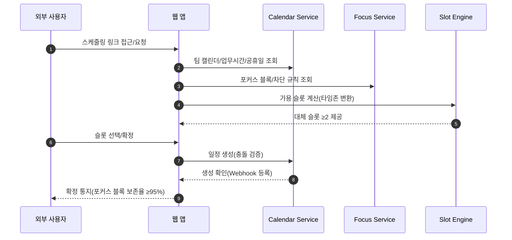
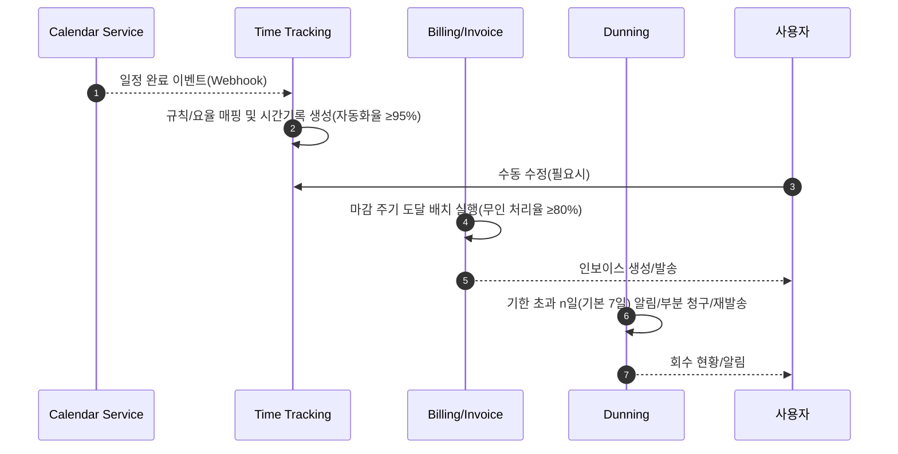
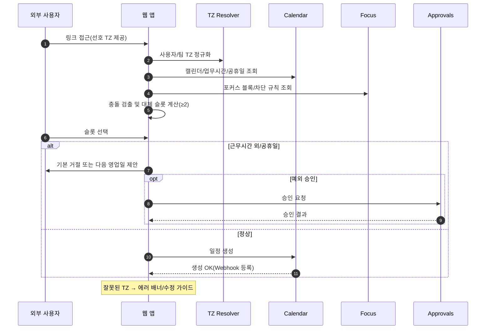
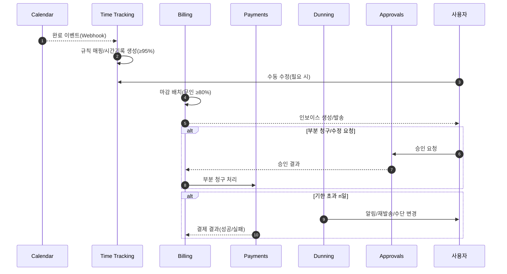

# Software Requirements Specification (SRS)

Document ID: SRS-001

Revision: 1.0

Date: 2025-11-18

Standard: ISO/IEC/IEEE 29148:2018

---

1. Introduction

1.1 Purpose

- 본 SRS는 PRD(`GPT-PRD/GPT-PRD.md`)를 유일한 요구사항 원천으로 하여 AI 생산성행동 트래킹 자동화 제품의 소프트웨어 요구사항을 ISO/IEC/IEEE 29148:2018에 따라 명세한다. 문제 정의는 일정·리소스·정산 데이터 분절로 인한 동기화 비용/누락/지연, 알림/회의로 인한 포커스 침식, 일정→시간기록→인보이스 파이프라인 부재, 온콜/교대 로스터 분산이다.
- 본 문서는 기능/비기능/인터페이스/데이터/제약을 분리하여 테스트 가능하고 추적 가능한 형태로 제공하며, MVP 범위를 명시하여 초기 릴리즈의 개발·테스트·운영 경계를 정의한다.

1.2 Scope (In-Scope / Out-of-Scope)

- In-Scope (제품 전체 관점)
  - 타임존 자동 스케줄링/링크 공유, 포커스 블록·차단 규칙
  - 짧은 미팅 프리셋(25/50분), 자동 요약(요약 API 연동)
  - 일정→시간기록 자동화, 마감 자동 인보이스, 미수 알림(dunning)
  - 페르소나 프리셋(규칙·템플릿·리포트), 승인 플로우, 감사 로그
  - 현금흐름 예측·최소상환 경고, 부분 청구/수정

- MVP Scope (Release 0)
  - Functional Requirements (Must 범위만 포함):
    - REQ-FUNC-001, REQ-FUNC-002, REQ-FUNC-003
    - REQ-FUNC-010, REQ-FUNC-011, REQ-FUNC-012
    - REQ-FUNC-020, REQ-FUNC-021, REQ-FUNC-022
  - Non-Functional Requirements:
    - REQ-NF-001 ~ REQ-NF-012 (성능/가용성/보안/비용/모니터링 핵심)
    - REQ-NF-013, REQ-NF-014, REQ-NF-015 ~ REQ-NF-019은 설계/관측 기반으로 준비하되, 일부 항목은 “최소 정책 수준”으로 구현
  - 제외(후속 릴리즈 대상):
    - Functional: REQ-FUNC-030, REQ-FUNC-031, REQ-FUNC-032, REQ-FUNC-033, REQ-FUNC-040, REQ-FUNC-041

- Out-of-Scope
  - 급여/세무 통합, 풀 ERP
  - 복잡한 다국가 세법 규칙의 자동 완전 대응
  - 풀 온콜 라우팅 엔진

- Constraints / Assumptions
  - 외부 기술·서비스 제약:
    - Google/Outlook API 쿼터 및 가용성, 요약 API 속도/비용, 결제 게이트웨이 가용성
    - LLM 호출은 사내 LLM Gateway를 통해 수행하며, 기본 모델은 Google Gemini 계열이다.
  - 보안/준거성 제약:
    - 데이터 지역화(선택), PII 마스킹, 감사로그 보존 1년+, 온콜/휴식 증빙 이벤트 불변 로그(append-only)
  - 기술 스택 제약 (C-TEC-001 ~ C-TEC-006):
    - C-TEC-001: 모든 프론트엔드 서비스는 Vite 기반 React.js 프레임워크를 사용한다.
    - C-TEC-002: 모든 백엔드 서비스는 JVM 기반(Java 17 + Spring Boot 3.x)을 사용한다.
    - C-TEC-003: 데이터베이스는 AWS 상의 MySQL 호환(예: Aurora MySQL 3.x, MySQL 8.x 이상) InnoDB 엔진에서 `utf8mb4` 유니코드 확장 문자 인코딩을 기본으로 사용한다.
    - C-TEC-004: 문서 자동생성 엔진은 Python 기반(LangChain + FastAPI)으로 구현하며, Java 백엔드에서 이를 HTTP/gRPC로 호출한다.
    - C-TEC-005: LLM 호출은 OpenAI 호환 인터페이스를 제공하는 사내 LLM Gateway를 사용하고, Gateway 내부에서 Google Gemini 모델을 우선 사용한다.
    - C-TEC-006: MSA 서비스 간 동기 통신은 REST(OpenAPI 3.x) 또는 gRPC로 제한한다.
  - 가정:
    - “연결·자동화”가 분절 도구 조합 대비 지불 의향을 형성한다.
    - MVP 기간 동안 사용량은 단일 리전(AWS) 내에서 처리 가능하며, 글로벌 리전 분산은 후속 범위로 한다.
  - 리스크:
    - 요약/예측 정확도 저하(휴먼 인 루프 검토·수정 UI 필요)
    - 예외 처리 복잡성(부분 청구/수정)으로 인한 도메인 모델 복잡도 증가
    - 초기 데이터 이관 난도(캘린더/시간기록/빌링 데이터 마이그레이션 도구 필요)

1.3 Definitions, Acronyms, Abbreviations

- JTBD: Jobs To Be Done
- AOS: Adjusted Opportunity Score
- DOS: Discovered Opportunity Score
- DND: 방해 금지(Do Not Disturb)
- KPI: 핵심성과지표
- p95: 95번째 백분위수 성능 지표
- SCIM: System for Cross-domain Identity Management
- RBAC: Role-Based Access Control
- Dunning: 미수금 회수 절차(알림/재발송/부분 청구)
- LLM Gateway: 내부 LLM 통합 게이트웨이(모델 선택/라우팅/로그/비용 제어)

1.4 References (REF-XX)

- REF-01: PRD — `GPT-PRD/GPT-PRD.md`
- REF-02: Proof — `2_핵심예제 분석자료/GPT-ValueProPositionSheet/GPT-ValueProPositionSheet.md`
- REF-03: Inputs Digest — `2_핵심예제 분석자료/GPT-ValueProPositionSheet/inputs_digest.md`
- REF-04: 모니터링 지표 — PRD §5, §8

2. Stakeholders

- G1 다시간대 협업 지식노동자: 타임존 조율·포커스 보호; 요구: 충돌 회피, 대체 슬롯 제안, 포커스 블록 보존
- G2 미팅 다빈도 사무직: 짧은 회의·자동 요약; 요구: 프리셋 준수, 종료 후 신속 요약, 알림 묶음 처리
- G4 프리랜서/전문가: 일정=시간기록=인보이스 자동화; 요구: 자동 전환, 마감 처리, 미수 회수
- G6 멀티앱 긱 워커: 수입/지출 통합·연체 방지; 요구: 예측/경고, 미수 알림
- 운영 리더(온콜/교대): 로스터·DND·준거성; 요구: 증빙 이벤트, 감사 로그
- 내부 팀(Owner 팀: Product·Eng·Data): 제품 요구 정의, 구현, 데이터 파이프라인/측정

1. System Context and Interfaces

3.1 External Systems

- Google Calendar / Microsoft Outlook:
  - 양방향 동기화(Webhook), 일정 생성/수정/취소 이벤트 수신
  - 충돌 감지 및 대체 슬롯 제안에 필요한 데이터 소스
- LLM Summary API (사내 LLM Gateway):
  - 회의 요약 생성(입력: transcript/노트 → 출력: 결정/액션/오너/기한)
  - OpenAI 호환 REST 인터페이스를 제공하며, 내부적으로 Google Gemini 모델 사용
- 결제 게이트웨이(예: Stripe):
  - 인보이스 발송/결제/재시도, 미수/연체 알림(dunning) 연계
  - 웹훅을 통한 결제 결과 수신
- Export/BI:
  - 회계용 CSV/Excel, Webhook(인보이스/결제 이벤트)
  - Amplitude/BigQuery/Grafana 등 분석/모니터링 도구

3.2 Client Applications

- 사용자 웹 클라이언트 (React + Vite):
  - 스케줄링 링크 뷰, 캘린더/포커스 설정 UI
  - 시간기록/인보이스 조회·수정, 요약 뷰 및 재생성 트리거
- 팀/관리 콘솔:
  - 페르소나 프리셋 관리, 승인 플로우, 감사 로그 및 알림/로스터 정책
  - KPI/리포트 대시보드(기본 테이블/차트)
- 백그라운드 워커:
  - 동기화/배치/마감/요약 트리거/리트라이 처리
  - AWS 기반 컨테이너 워커(예: ECS/Fargate 또는 Lambda)

3.3 API Overview

- 논리적 서비스
  - Calendar Service: 외부 캘린더 연동·가용 슬롯 계산
  - Focus Service: 포커스 블록/차단 규칙 관리
  - Meeting/Summary Service: 회의 메타·요약 관리
  - Time Tracking Service: 시간기록 자동화·수정
  - Billing/Dunning Service: 인보이스·결제·미수 관리
  - Preset/Approval/Audit Service: 규칙 프리셋, 승인, 감사 로그
  - Export Service: CSV/Excel/Webhook
  - LLM Orchestrator: Python(LangChain + FastAPI) 기반 문서/요약 워크플로

- 핵심 REST API (예시; OpenAPI 3.x로 문서화)

  - GET `/api/v1/schedule/slots`
    - Purpose: 팀 캘린더/포커스/업무시간/공휴일을 반영한 가용·대체 슬롯 조회
    - Query Parameters:
      - `start` (ISO8601, 필수), `end` (ISO8601, 필수), `tz` (IANA TZ, 필수), `attendees[]` (이메일 목록, 옵션)
    - Response 200:
      - `{ "slots": [ { "start": ISO8601, "end": ISO8601, "score": number } ] }`
    - Errors 4xx:
      - `CALENDAR_TZ_INVALID`, `TIME_RANGE_INVALID`, `POLICY_VIOLATION`
    - Rate Limit: 30 r/m per user, Idempotent: YES (GET)

  - POST `/api/v1/meetings/{id}/summary`
    - Purpose: 회의 종료 후 요약 생성 트리거
    - Body:
      - `{ "transcriptUrl"?: string, "notes"?: string, "language"?: string }`
    - Response 202:
      - `{ "jobId": string, "etaSec": number }`
    - Errors:
      - `SUMMARY_INPUT_INVALID`, `SUMMARY_PROVIDER_UNAVAILABLE`, `SUMMARY_QUOTA_EXCEEDED`
    - Retry:
      - LLM Gateway 레벨에서 지수 백오프(최대 5회), Idempotency-Key 헤더 필수

  - POST `/api/v1/invoices/run-billing-cycle`
    - Purpose: 주/월 마감 배치 실행
    - Body:
      - `{ "cycle": "weekly"|"monthly", "asOf": ISO8601, "dryRun"?: boolean, "teamId"?: string }`
    - Response 202:
      - `{ "runId": string, "queued": number }`
    - Safety:
      - Idempotency-Key 필수, 동일 키에 대해 동일 결과 보장(24h 캐시)

  - POST `/api/v1/dunning/reminders`
    - Purpose: 미수 인보이스에 대한 알림 스케줄링
    - Body:
      - `{ "invoiceId": string, "strategy": "email"|"sms"|"all", "afterDays"?: number }` (기본 7일)
    - Response 200:
      - `{ "reminderId": string, "scheduledAt": ISO8601 }`
    - Errors:
      - `INVOICE_NOT_DUE`, `CHANNEL_QUOTA_EXCEEDED`, `INVALID_STRATEGY`

- 고수준 API 리스트 (요약)

  - Calendar: `/api/v1/calendar/webhook`, `/api/v1/schedule/slots`, `/api/v1/schedule/book`
  - Focus: `/api/v1/focus/blocks`, `/api/v1/notifications/dnd`
  - Summary: `/api/v1/meetings/{id}/summary`, `/api/v1/meetings/summary/retry`
  - Time Tracking: `/api/v1/time-entries`, `/api/v1/time-entries/{id}`
  - Invoicing: `/api/v1/invoices`, `/api/v1/invoices/run-billing-cycle`, `/api/v1/invoices/{id}/send`
  - Dunning: `/api/v1/dunning/reminders`, `/api/v1/dunning/{invoiceId}/resend`, `/api/v1/payments/partial`
  - Presets/Audit: `/api/v1/presets/personas`, `/api/v1/approvals`, `/api/v1/audit-logs`
  - Export: `/api/v1/export/{format}`, `/api/v1/webhooks`
  - Auth/SCIM: `/api/v1/oauth/callback`, `/api/v1/scim/**`

3.4 Interaction Sequences (핵심 시퀀스 다이어그램 포함)

- 타임존 자동 스케줄링(충돌 회피 및 포커스 보호)

- 일정→시간기록→인보이스 자동 파이프라인

2. Specific Requirements

4.1 Functional Requirements (테이블)

| ID | Title | Description | Source(Story) | Acceptance Criteria(G/W/T) | Priority | Dependencies |
|---|---|---|---|---|---|---|
| REQ-FUNC-001 | 타임존 기반 가용 슬롯 계산 | 팀 캘린더·업무시간·공휴일·포커스 규칙을 반영해 타임존별 대체 슬롯 제안 | PRD §3.1 | Given 팀 캘린더/업무시간, When 외부 링크로 요청, Then p95 조율 왕복 ≤2, 평균 확정 리드타임 ≤2h, 대체 슬롯 ≥2 | Must | Calendar, Focus |
| REQ-FUNC-002 | 포커스 블록 보존 및 충돌 회피 | 충돌 가능한 요청에 대해 자동 대체 슬롯 제안 및 포커스 블록 보호 | PRD §3.1 | Given 포커스 블록, When 충돌 요청, Then 대체 슬롯 ≥2, 포커스 블록 보존율 ≥95% | Must | Focus |
| REQ-FUNC-003 | 근무시간 외 처리/예외 승인 | 공휴일/근무시간 외 요청 시 기본 거절 또는 다음 영업일 제안, 예외 승인 플로우 | PRD §3.1 | Given 근무시간 외, When 일정 생성 요청, Then 기본 거절 또는 다음 영업일 제안; 잘못된 TZ 시 에러 배너/가이드 | Must | Calendar, Approvals |
| REQ-FUNC-010 | 짧은 회의 프리셋 | 25/50분 프리셋 제공 및 기본 적용 | PRD §3.2 | Given 프리셋, When 회의 생성, Then 프리셋 준수율 ≥80%, p95 실제 지속시간 ≤ 프리셋+5분 | Must | Calendar |
| REQ-FUNC-011 | 자동 회의 요약 생성 | 회의 종료 시 요약 트리거 및 생성 | PRD §3.2 | Given 회의 종료, When 요약 생성, Then p95 지연 ≤30s, 필수 항목(결정/액션/오너/기한) 누락률 ≤5%, 실패 시 재시도 3회·수동 재생성 | Must | Summary API(LLM Gateway) |
| REQ-FUNC-012 | 알림 묶음 처리(DND) | 알림 폭주 시 DND 창구로 묶음 처리하고 배치 노출 | PRD §3.2 | Given DND 창구, When >10건/15분, Then 묶음 처리, 창구 종료 후 배치 노출 | Must | Notifications |
| REQ-FUNC-020 | 일정→시간기록 자동화 | 일정 완료 시 시간기록 자동 생성 및 수동 수정 UI 제공 | PRD §3.3 | Given 청구 규칙, When 일정 완료, Then 자동 생성율 ≥95%, 수동 수정 가능 | Must | Time Tracking |
| REQ-FUNC-021 | 마감 자동 인보이스 | 마감 주기 도달 시 인보이스 생성·발송 무인 처리 | PRD §3.3 | Given 마감 주기, When 마감일, Then 무인 처리율 ≥80% | Must | Billing |
| REQ-FUNC-022 | 미수 회수 플로우 | 기한 초과 n일(기본 7일) 알림·부분 청구·재발송·수단 변경 | PRD §3.3 | Given 미수, When 기한 초과, Then 회수율 ≥ 기준선+15%p; 결제 실패 시 재시도/수단 변경/오프라인 안내 | Must | Billing/Dunning |
| REQ-FUNC-030 | 현금흐름 예측/경고 | 현금흐름 예측 및 최소 상환 경고 | PRD §4 Should | Given 데이터, When 예측 실행, Then 예측 정확도 기준/경보 임계치 설정 및 알림 발송 | Should | Billing, LLM Gateway |
| REQ-FUNC-031 | 부분 청구/수정 | 부분 청구 처리 및 인보이스 수정 | PRD §4 Should | Given 인보이스, When 부분 청구/수정 요청, Then 규칙 검증·승인 후 처리 | Should | Billing, Approvals |
| REQ-FUNC-032 | 페르소나 프리셋 | 역할별 규칙·템플릿·리포트 프리셋 제공 | PRD §4 Should | Given 역할, When 프리셋 적용, Then 기본 규칙/리포트 활성화 | Should | Presets |
| REQ-FUNC-033 | 승인 플로우·감사로그 | 중요 예외/수정 시 승인 및 감사로그 기록 | PRD §4 Should | Given 예외, When 승인 요청, Then 승인 기록·감사 로그 생성/보존 ≥1년 | Should | Approvals, Audit |
| REQ-FUNC-040 | 온콜 로스터/알림 정책 | 팀 온콜 로스터·역할별 알림 정책 | PRD §4 Could | Given 로스터 규칙, When 알림 라우팅, Then 정책에 따른 라우팅 | Could | Notifications |
| REQ-FUNC-041 | 외부 보고 리포트 | 외부 전달용 리포트 생성 | PRD §4 Could | Given 데이터, When 리포트 요청, Then 지정 포맷으로 생성 | Could | Export |

4.2 Non-Functional Requirements (테이블)

| ID | Category | Requirement | Metric/Value | Verification |
|---|---|---|---|---|
| REQ-NF-001 | 성능(UI) | UI 응답 p95 | ≤ 800ms | 부하/프로파일링 |
| REQ-NF-002 | 성능(API) | 백엔드 API p95 | ≤ 500ms | APM 지표 |
| REQ-NF-003 | 성능(배치/동기화) | 동기화 지연 p95 | ≤ 5분 | 배치 모니터링 |
| REQ-NF-004 | 성능(요약) | 요약 생성 p95 | ≤ 30초 | 작업 큐 지표 |
| REQ-NF-005 | 가용성 | 월 가용성 | ≥ 99.5% (Beta) | SLO 대시보드 |
| REQ-NF-006 | 신뢰성 | 오류율(5xx) | ≤ 0.5% | 로그/알람 |
| REQ-NF-007 | 보안 | OAuth2.0/SCIM 지원 | 필수 | 침투 테스트 |
| REQ-NF-008 | 프라이버시 | PII 마스킹, 데이터 지역화(선택) | 필수 | 데이터 점검 |
| REQ-NF-009 | 준거성/감사 | 감사로그 보존 | ≥ 1년, append-only(온콜/휴식 증빙 이벤트 불변) | 로그 검증 |
| REQ-NF-010 | 비용 | 요약 1건당 모델 비용 | ≤ $0.01 | 비용 리포트 |
| REQ-NF-011 | 비용/운영 | 사용자당 월 인프라 비용 한도 경보 | 임계치 설정 | 알림 테스트 |
| REQ-NF-012 | 모니터링 | 대시보드/알림 항목 | 지연 p95/p99, 실패율, 동기화 백로그, 요약 지연, 파이프라인 전환율 | 관측성 점검 |
| REQ-NF-013 | 확장성 | 동시 사용자/워크로드 증가 시 선형 확장 | 기준선 대비 처리량 ≥x 배 확장 | 부하 테스트 |
| REQ-NF-014 | 유지보수성 | 서비스/모듈 경계·계약 테스트 | 변경 시간/결함률 저감 | 코드 리뷰/테스트 |
| REQ-NF-015 | 신뢰성(외부 API 리트라이) | 외부 API 실패 시 지수 백오프 리트라이 | 1s·2^n, 최대 5회, Jitter ±20% | 통합 테스트 |
| REQ-NF-016 | 신뢰성(서킷 브레이커) | 외부 API 실패율 급증 시 서킷 브레이커 | 60s 창 실패율>20% → open 30s → half-open 5샘플 → close | 카나리 테스트 |
| REQ-NF-017 | 신뢰성(Webhook) | Webhook 서명 검증/중복 방지 | HMAC-SHA256 서명 검증, dedupKey TTL 24h, 재시도 3회 | 보안/통합 테스트 |
| REQ-NF-018 | 신뢰성(Idempotency) | 중요 POST 요청의 멱등성 보장 | Idempotency-Key 필수, 24h 키 캐시 | API 테스트 |
| REQ-NF-019 | 운영 정책(에러버짓) | 가용성 99.5% 기준 에러버짓 관리 | 월간 에러버짓 소모율>200% 시 변경 중단/롤백 | 운영 프로세스 검토 |
| REQ-NF-020 | 보안(OAuth Scope) | 기능별 최소 권한 스코프 적용 | calendar.read/write, summary.write, time.write, invoice.write, dunning.write 등 | 보안 리뷰 |
| REQ-NF-021 | 보안(RBAC) | 단순 RBAC 롤 정의 | Owner/Member/Viewer 3단계, 롤별 API 접근 제어 | 권한 테스트 |
| REQ-NF-022 | 프라이버시/보존 | PII 필드 암호화 및 보존기간 관리 | PII(AES-256-GCM, TLS1.2+), transcript 30d, summary 1y, 감사로그 1y+ | 데이터 감사 |

1. Traceability Matrix

| Story (PRD) | Requirement IDs | Test Case IDs |
|---|---|---|
| §3.1 타임존 자동 스케줄링 | REQ-FUNC-001, REQ-FUNC-002, REQ-FUNC-003 | TC-001-1, TC-001-2, TC-001-3 |
| §3.2 포커스 보호·회의 요약 | REQ-FUNC-010, REQ-FUNC-011, REQ-FUNC-012 | TC-002-1, TC-002-2, TC-002-3 |
| §3.3 일정=시간기록=인보이스 | REQ-FUNC-020, REQ-FUNC-021, REQ-FUNC-022 | TC-003-1, TC-003-2, TC-003-3 |
| §4 Should 항목 | REQ-FUNC-030, REQ-FUNC-031, REQ-FUNC-032, REQ-FUNC-033 | TC-004-1..4 |
| §4 Could 항목 | REQ-FUNC-040, REQ-FUNC-041 | TC-005-1..2 |
| NFR(§5) | REQ-NF-001..022 | TCNF-001..022 |

- Test Case 개요 (MVP 핵심 TC 예시)

  - TC-001-1 (REQ-FUNC-001)
    - Given: 팀 업무시간/공휴일/포커스 블록이 설정된 상태
    - When: `/api/v1/schedule/slots?start=...&end=...&tz=...` 호출
    - Then: 응답에서 대체 슬롯 ≥2, 시뮬레이션 기준 평균 확정 리드타임 ≤2h

  - TC-002-2 (REQ-FUNC-011)
    - Given: 회의가 종료되고 transcript 또는 notes가 저장된 상태
    - When: `POST /api/v1/meetings/{id}/summary` 호출
    - Then: p95 요약 생성 지연 ≤30s, 필수 항목 누락률 ≤5%, 실패 시 3회 재시도 및 수동 재생성 버튼 제공

  - TC-003-1 (REQ-FUNC-020)
    - Given: 청구 규칙이 설정된 100개의 완료 일정
    - When: 캘린더 Webhook으로 완료 이벤트 수신
    - Then: 자동 생성된 시간기록이 95개 이상(≥95%), 각 이벤트에 대한 수동 수정 UI가 노출

  - TCNF-001 (REQ-NF-002)
    - Given: 부하 테스트 환경(500 rps, 대표 API)
    - When: 1시간 동안 동시 호출
    - Then: p95 응답시간 ≤500ms, 5xx 오류율 ≤0.5%

1. Appendix

6.1 API Endpoint List

| Method | Path | Purpose | Auth |
|---|---|---|---|
| POST | /api/v1/calendar/webhook | 캘린더 이벤트 수신 | OAuth + Webhook 서명 |
| GET | /api/v1/schedule/slots | 가용/대체 슬롯 조회 | OAuth |
| POST | /api/v1/schedule/book | 슬롯 확정/생성 | OAuth |
| GET/POST | /api/v1/focus/blocks | 포커스 블록 CRUD | OAuth |
| POST | /api/v1/notifications/dnd | DND 창구 열기/닫기 | OAuth |
| POST | /api/v1/meetings/{id}/summary | 회의 요약 생성 | OAuth |
| POST | /api/v1/meetings/summary/retry | 요약 재시도 | OAuth |
| GET/POST | /api/v1/time-entries | 시간기록 조회/생성 | OAuth |
| PATCH | /api/v1/time-entries/{id} | 시간기록 수정 | OAuth |
| POST | /api/v1/invoices/run-billing-cycle | 마감 배치 실행 | OAuth |
| GET/POST | /api/v1/invoices | 인보이스 조회/생성 | OAuth |
| POST | /api/v1/invoices/{id}/send | 인보이스 발송 | OAuth |
| POST | /api/v1/dunning/reminders | 미수 알림 발송 | OAuth |
| POST | /api/v1/dunning/{invoiceId}/resend | 재발송 | OAuth |
| POST | /api/v1/payments/partial | 부분 청구 | OAuth |
| GET/POST | /api/v1/presets/personas | 페르소나 프리셋 관리 | OAuth |
| GET/POST | /api/v1/approvals | 승인 플로우 | OAuth |
| GET | /api/v1/audit-logs | 감사 로그 조회 | OAuth |
| GET | /api/v1/export/{format} | CSV/Excel 내보내기 | OAuth |
| POST | /api/v1/webhooks | 외부 Webhook 등록 | OAuth |
| GET | /api/v1/scim/** | SCIM 프로비저닝 | OAuth |

6.2 Entity & Data Model (표)

| Entity | Key Fields (예시, MySQL InnoDB) | Notes |
|---|---|---|
| User | `id` BIGINT PK, `team_id` BIGINT FK, `role` ENUM('owner','member','viewer'), `timezone` VARCHAR(64) NOT NULL, `preferences` JSON | OAuth/SCIM 연동, IDX(team_id) |
| Team | `id` BIGINT PK, `name` VARCHAR(255), `business_hours` JSON, `holidays` JSON | 정책/프리셋 단위 |
| CalendarEvent | `id` BIGINT PK, `external_id` VARCHAR(255) UNIQUE, `team_id` BIGINT FK, `start_at` DATETIME(3) NOT NULL, `end_at` DATETIME(3) NOT NULL, `timezone` VARCHAR(64) NOT NULL, `status` ENUM('tentative','confirmed','canceled'), `project_id` BIGINT NULL | CHECK(end_at > start_at), IDX(team_id, start_at) |
| FocusBlock | `id` BIGINT PK, `user_id` BIGINT FK, `start_at` DATETIME(3) NOT NULL, `end_at` DATETIME(3) NOT NULL, `rule_id` BIGINT NULL | 포커스 차단 규칙 |
| SummaryNote | `id` BIGINT PK, `event_id` BIGINT FK UNIQUE, `decisions` JSON, `action_items` JSON, `created_at` DATETIME(3) DEFAULT CURRENT_TIMESTAMP | action_items: [{owner:userId, due:DATE, text:VARCHAR}] |
| TimeEntry | `id` BIGINT PK, `event_id` BIGINT FK UNIQUE, `duration_min` INT NOT NULL, `rate` DECIMAL(10,2), `billable` TINYINT(1) DEFAULT 1, `approved_at` DATETIME(3) NULL | CHECK(duration_min > 0) |
| Invoice | `id` BIGINT PK, `customer_id` BIGINT FK, `amount` DECIMAL(12,2) CHECK(amount >= 0), `due_date` DATE NOT NULL, `status` ENUM('draft','sent','paid','overdue'), `sent_at` DATETIME(3), `paid_at` DATETIME(3) | IDX(customer_id,status,due_date) |
| PaymentReminder | `id` BIGINT PK, `invoice_id` BIGINT FK, `sent_at` DATETIME(3), `channel` ENUM('email','sms','push'), `status` ENUM('scheduled','sent','failed') | dunning 이력 |
| RosterRule | `id` BIGINT PK, `team_id` BIGINT FK, `schedule` JSON, `policy` JSON | 온콜/알림 정책 |
| AuditLog | `id` BIGINT PK, `actor_id` BIGINT, `action` VARCHAR(255), `target_type` VARCHAR(64), `target_id` VARCHAR(64), `created_at` DATETIME(3) DEFAULT CURRENT_TIMESTAMP, `hash` VARCHAR(255) NOT NULL, `prev_hash` VARCHAR(255) NULL | append-only, 해시체인(WORM) |

6.3 Detailed Interaction Models

- 타임존 스케줄링(에러/예외 포함 상세)

- 일정→시간기록→인보이스→미수 회수(부분 청구 포함)

