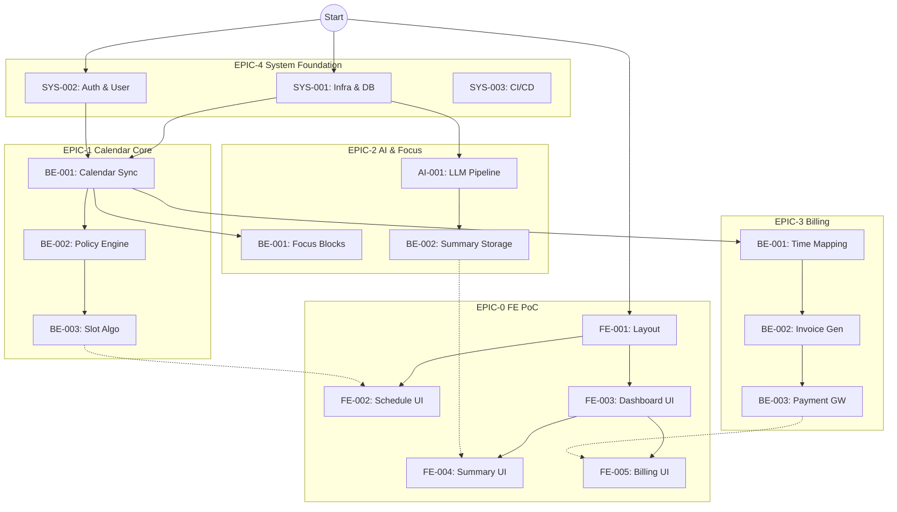

# MVP 개발 Task WBS 및 의존성 그래프 (DAG)

## 1. 개요
이 문서는 `GPT-SRS-v02.md`를 기반으로 "AI 생산성행동 트래킹 자동화" 제품의 MVP 개발을 위한 전체 작업 분할 구조(WBS)와 의존성 그래프(DAG)를 정의합니다. AI 에이전트가 이 구조를 참조하여 Task의 선후 관계를 파악하고 실행 계획을 수립합니다.

## 2. Epic 목록 및 정의

| Epic ID | Epic Name | Description | 관련 REQ |
|---|---|---|---|
| **EPIC-0** | **FE PoC Prototype** | 전체 제품의 주요 사용자 플로우를 커버하는 프론트엔드 프로토타입 (Breadth-first) | All UI REQs |
| **EPIC-1** | **Calendar Core** | 타임존 자동 스케줄링, 구글/아웃룩 연동, 가용 슬롯 계산 엔진 | REQ-FUNC-001, 003 |
| **EPIC-2** | **Focus & AI** | 포커스 블록 보호 로직, 회의 요약(LLM) 파이프라인 | REQ-FUNC-002, 010, 011 |
| **EPIC-3** | **Billing System** | 일정→시간기록 자동화, 인보이스 생성/발송, 미수 관리 | REQ-FUNC-020, 021, 022 |
| **EPIC-4** | **System & NFR** | 인프라, 배포 파이프라인, 인증(OAuth/SCIM), 보안, 모니터링 | REQ-NF-ALL |

---

## 3. Task WBS (Work Breakdown Structure)

### 3.1. EPIC-0: FE PoC Prototype (우선순위: 1)
> **목표:** 백엔드 없이 Mock API를 활용하여 주요 화면의 UI/UX 흐름을 빠르게 검증한다.

*   `EPIC0-FE-001`: 공통 레이아웃 및 내비게이션 (GNB, Sidebar)
*   `EPIC0-FE-002`: 스케줄링 링크 및 예약 페이지 UI (외부 사용자용)
*   `EPIC0-FE-003`: 대시보드 및 캘린더 메인 뷰 UI
*   `EPIC0-FE-004`: 회의 요약 및 액션 아이템 상세 뷰 UI
*   `EPIC0-FE-005`: 시간 기록 및 인보이스 관리 테이블 UI

### 3.2. EPIC-1: Calendar Core Service (우선순위: 2)
> **목표:** 핵심 가치인 "충돌 없는 스케줄링"을 위한 백엔드 엔진을 구현한다.

*   `EPIC1-BE-001`: Google/Outlook Calendar 양방향 동기화 및 Webhook 수신부
*   `EPIC1-BE-002`: 타임존 정규화 및 업무시간/공휴일 정책 엔진
*   `EPIC1-BE-003`: 가용 슬롯 계산 알고리즘 (충돌 회피 로직)
*   `EPIC1-BE-004`: 스케줄링 예약 및 확정 트랜잭션 처리

### 3.3. EPIC-2: Focus & AI Service (우선순위: 2)
> **목표:** 업무 몰입 보호 및 회의 생산성 향상 기능을 구현한다.

*   `EPIC2-BE-001`: 포커스 블록 생성 및 동적 차단 규칙 구현
*   `EPIC2-AI-001`: 회의 녹취/노트 수신 및 LLM 프롬프트 파이프라인 (LangChain)
*   `EPIC2-BE-002`: 요약 결과 파싱 및 구조화 저장 (Action Item 추출)
*   `EPIC2-BE-003`: 짧은 회의(Speedy Meeting) 프리셋 적용 로직

### 3.4. EPIC-3: Billing & Time Tracking (우선순위: 3)
> **목표:** 수익화의 핵심인 청구 자동화를 구현한다.

*   `EPIC3-BE-001`: 캘린더 이벤트 → 시간 기록(TimeEntry) 자동 매핑 로직
*   `EPIC3-BE-002`: 인보이스 생성 및 상태 관리 (Draft -> Sent -> Paid)
*   `EPIC3-BE-003`: 결제 게이트웨이(Stripe) 연동 및 Webhook 처리
*   `EPIC3-BE-004`: 미수금 알림(Dunning) 스케줄러 및 발송 엔진

### 3.5. EPIC-4: System & NFR (Non-Functional) (우선순위: 0 - 병렬 진행)
> **목표:** 운영 가능한 수준의 품질과 보안을 확보한다.

*   `EPIC4-SYS-001`: AWS 인프라 프로비저닝 (Terraform/CDK) 및 DB 구축
*   `EPIC4-SYS-002`: OAuth 2.0 인증 서버 구성 및 JWT 핸들링
*   `EPIC4-SYS-003`: CI/CD 파이프라인 구성 (GitHub Actions)
*   `EPIC4-NFR-001`: 구조화 로깅(JSON) 및 중앙 집중식 모니터링 설정 (REQ-NF-012)
*   `EPIC4-NFR-002`: 민감 정보(PII) 마스킹 및 암호화 계층 구현 (REQ-NF-008)
*   `EPIC4-NFR-003`: API Rate Limiting 및 Circuit Breaker 설정 (REQ-NF-016)

---

## 4. 의존성 그래프 (DAG) & 실행 순서

아래 그래프는 Task 그룹 간의 선후행 관계를 나타냅니다. 에이전트는 이를 참고하여 병렬 실행 가능한 작업을 식별합니다.

## 5. 에이전트 실행 가이드 요약
1. **초기 단계**: `EPIC-4(SYS)`와 `EPIC-0(FE PoC)`를 병렬로 착수합니다. FE 에이전트는 Mock 데이터를 이용해 UI를 먼저 잡고, BE 에이전트는 인프라를 깝니다.
2. **핵심 구현**: `EPIC-1(Calendar)`이 가장 중요하며 다른 Epic의 기반이 됩니다.
3. **확장**: `EPIC-2`와 `EPIC-3`는 `EPIC-1`의 데이터 구조가 안정화된 후 진행하는 것이 효율적입니다.

