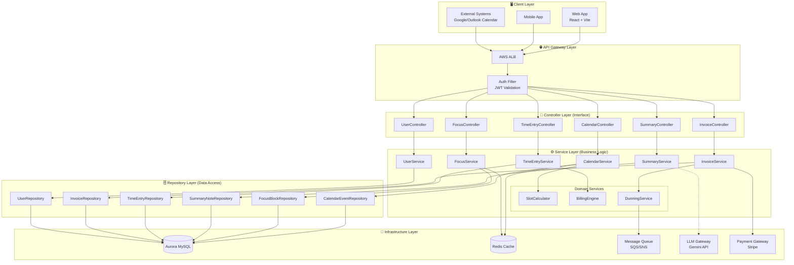
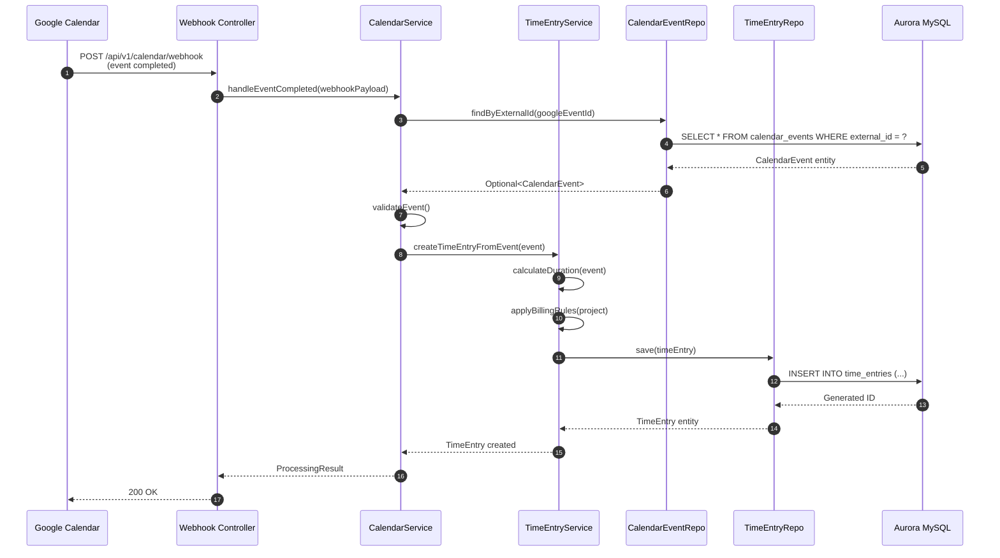

# Issue #001: AWS 인프라 및 데이터베이스 환경 구축

## 📋 개요
Terraform을 사용하여 서비스 운영을 위한 AWS 클라우드 인프라(VPC, Subnet, Aurora MySQL, ECS Cluster)를 프로비저닝한다.

## 🎯 목표
- 보안 모범 사례를 준수하는 AWS 인프라 구성
- 코드형 인프라(IaC)로 재현 가능한 환경 구축
- 개발/운영 환경 분리

---

# 🚀 개발 환경 옵션 (Environment Options)

> 💡 **개발 단계별로 적절한 환경을 선택하세요!**

## 📊 환경별 비교

| 환경 | 월 비용 | 적합한 상황 | 설정 난이도 |
|------|---------|------------|------------|
| **🐳 Option A: Docker Local** | **$0** | 혼자 개발, PoC, 오프라인 | ⭐ 쉬움 |
| **☁️ Option B: 무료 클라우드** | **$0** | 팀 협업, 데모, 외부 공유 | ⭐⭐ 보통 |
| **🆓 Option C: AWS Free Tier** | **$0** (12개월) | 프로덕션 준비, 학습 | ⭐⭐⭐ 어려움 |
| **💰 Option D: AWS 프로덕션** | ~$100-150 | 실제 서비스 운영 | ⭐⭐⭐ 어려움 |

```
추천 개발 전략:
┌─────────────────────────────────────────────────────────────┐
│  Phase 1 (개발)     →  Phase 2 (테스트)  →  Phase 3 (운영)  │
│  Docker Local ($0)     무료 클라우드 ($0)    AWS ($100+)    │
└─────────────────────────────────────────────────────────────┘
```

---

## 🐳 Option A: Docker Compose 로컬 환경 (완전 무료)

> **추천**: 개인 개발, PoC, 빠른 프로토타이핑

### 사전 조건

| 항목 | 요구사항 | 확인 방법 |
|------|----------|----------|
| Docker | v24+ | `docker --version` |
| Docker Compose | v2.x | `docker compose version` |
| Java | JDK 17+ | `java -version` |
| 여유 메모리 | 4GB+ | - |

### docker-compose.yml

```yaml
version: '3.8'

services:
  # MySQL 8.0 (Aurora MySQL 호환)
  mysql:
    image: mysql:8.0
    container_name: bizplan-mysql
    environment:
      MYSQL_ROOT_PASSWORD: rootpassword
      MYSQL_DATABASE: bizplan
      MYSQL_USER: bizplan
      MYSQL_PASSWORD: bizplanpassword
    ports:
      - "3306:3306"
    volumes:
      - mysql_data:/var/lib/mysql
      - ./init-scripts:/docker-entrypoint-initdb.d
    command: >
      --character-set-server=utf8mb4
      --collation-server=utf8mb4_unicode_ci
      --default-time-zone='+00:00'
    healthcheck:
      test: ["CMD", "mysqladmin", "ping", "-h", "localhost"]
      interval: 10s
      timeout: 5s
      retries: 5

  # Redis (캐시용)
  redis:
    image: redis:7-alpine
    container_name: bizplan-redis
    ports:
      - "6379:6379"
    volumes:
      - redis_data:/data
    healthcheck:
      test: ["CMD", "redis-cli", "ping"]
      interval: 10s
      timeout: 5s
      retries: 5

  # MailHog (이메일 테스트용)
  mailhog:
    image: mailhog/mailhog
    container_name: bizplan-mailhog
    ports:
      - "1025:1025"  # SMTP
      - "8025:8025"  # Web UI

  # Adminer (DB 관리 UI)
  adminer:
    image: adminer
    container_name: bizplan-adminer
    ports:
      - "8081:8080"
    depends_on:
      - mysql

volumes:
  mysql_data:
  redis_data:
```

### 실행 방법

```bash
# 1. 컨테이너 시작
docker compose up -d

# 2. 상태 확인
docker compose ps

# 3. MySQL 접속 테스트
docker exec -it bizplan-mysql mysql -ubizplan -pbizplanpassword bizplan

# 4. 로그 확인
docker compose logs -f mysql

# 5. 종료
docker compose down

# 6. 데이터 포함 완전 삭제
docker compose down -v
```

### Spring Boot 로컬 설정 (application-local.yml)

```yaml
spring:
  profiles:
    active: local
  
  datasource:
    url: jdbc:mysql://localhost:3306/bizplan?useSSL=false&allowPublicKeyRetrieval=true&serverTimezone=UTC
    username: bizplan
    password: bizplanpassword
    driver-class-name: com.mysql.cj.jdbc.Driver
  
  jpa:
    hibernate:
      ddl-auto: validate
    properties:
      hibernate:
        dialect: org.hibernate.dialect.MySQLDialect
        format_sql: true
    show-sql: true
  
  data:
    redis:
      host: localhost
      port: 6379
  
  mail:
    host: localhost
    port: 1025

  flyway:
    enabled: true
    locations: classpath:db/migration
```

### 접속 정보

| 서비스 | URL | 인증 정보 |
|--------|-----|----------|
| MySQL | `localhost:3306` | `bizplan` / `bizplanpassword` |
| Redis | `localhost:6379` | - |
| Adminer (DB UI) | http://localhost:8081 | MySQL 정보 사용 |
| MailHog (메일 UI) | http://localhost:8025 | - |
| Spring Boot App | http://localhost:8080 | - |

---

## ☁️ Option B: 무료 클라우드 서비스 조합 ($0/월)

> **추천**: 팀 협업, 외부 데모, 항상 접근 가능한 환경

### 무료 클라우드 서비스 목록

| 서비스 | 무료 티어 | 용도 | 링크 |
|--------|----------|------|------|
| **[PlanetScale](https://planetscale.com)** | 5GB, 1B reads/월 | MySQL 호환 DB | [가입](https://planetscale.com) |
| **[Supabase](https://supabase.com)** | 500MB, 무제한 API | PostgreSQL + Auth | [가입](https://supabase.com) |
| **[Neon](https://neon.tech)** | 0.5GB, 무제한 | PostgreSQL | [가입](https://neon.tech) |
| **[Railway](https://railway.app)** | $5 크레딧/월 | 앱 + DB 호스팅 | [가입](https://railway.app) |
| **[Render](https://render.com)** | 무료 웹서비스 | Spring Boot 배포 | [가입](https://render.com) |
| **[Upstash](https://upstash.com)** | 10K 요청/일 | Serverless Redis | [가입](https://upstash.com) |
| **[Resend](https://resend.com)** | 3K 이메일/월 | 이메일 발송 | [가입](https://resend.com) |

### 추천 조합 (완전 무료)

```
┌─────────────────────────────────────────────────────────┐
│                    무료 스택 구성                         │
├─────────────────────────────────────────────────────────┤
│  Database:  PlanetScale (MySQL) 또는 Supabase (Postgres) │
│  Cache:     Upstash Redis                                │
│  Backend:   Railway 또는 Render                          │
│  Email:     Resend                                       │
└─────────────────────────────────────────────────────────┘
```

### PlanetScale + Railway 설정 예시

**1. PlanetScale 데이터베이스 생성**
```bash
# PlanetScale CLI 설치 (macOS)
brew install planetscale/tap/pscale

# 로그인
pscale auth login

# 데이터베이스 생성
pscale database create bizplan --region us-east

# 연결 문자열 가져오기
pscale connect bizplan main --port 3309
```

**2. Spring Boot 설정 (application-cloud.yml)**
```yaml
spring:
  profiles:
    active: cloud
  
  datasource:
    url: jdbc:mysql://${PLANETSCALE_HOST}:3306/${PLANETSCALE_DATABASE}?sslMode=VERIFY_IDENTITY
    username: ${PLANETSCALE_USERNAME}
    password: ${PLANETSCALE_PASSWORD}
    driver-class-name: com.mysql.cj.jdbc.Driver
  
  data:
    redis:
      host: ${UPSTASH_REDIS_HOST}
      port: 6379
      password: ${UPSTASH_REDIS_PASSWORD}
      ssl:
        enabled: true
```

**3. Railway 배포**
```bash
# Railway CLI 설치
npm install -g @railway/cli

# 로그인 및 프로젝트 생성
railway login
railway init

# 환경 변수 설정
railway variables set PLANETSCALE_HOST=xxx.psdb.cloud
railway variables set PLANETSCALE_DATABASE=bizplan
# ... 기타 변수

# 배포
railway up
```

---

## 🆓 Option C: AWS Free Tier (12개월 무료)

> **추천**: 프로덕션 준비, AWS 학습, 신규 AWS 계정

### Free Tier 리소스

| 리소스 | 무료 범위 | 기간 |
|--------|----------|------|
| EC2 | t2.micro 750시간/월 | 12개월 |
| RDS | db.t2.micro 750시간/월, 20GB | 12개월 |
| S3 | 5GB | 12개월 |
| Lambda | 100만 요청/월 | 영구 |
| CloudWatch | 기본 모니터링 | 영구 |

### 비용 절감 아키텍처

```
기존 구성 (~$100-150/월)          →    Free Tier 구성 ($0/월)
─────────────────────────────────────────────────────────────
NAT Gateway ($35)                 →    NAT Instance (t2.micro 무료)
RDS Aurora ($50-70)               →    RDS MySQL t2.micro (무료)
ECS Fargate ($15-20)              →    EC2 t2.micro + Docker (무료)
ALB ($20)                         →    EC2에서 직접 서빙 (무료)
```

### Free Tier용 Terraform 변경점

```hcl
# modules/rds/main.tf - Free Tier 버전
resource "aws_db_instance" "main" {
  identifier           = "bizplan-mysql"
  engine              = "mysql"
  engine_version      = "8.0"
  instance_class      = "db.t2.micro"  # Free Tier!
  allocated_storage   = 20             # Free Tier 최대
  
  db_name             = "bizplan"
  username            = "admin"
  password            = var.db_password
  
  skip_final_snapshot = true
  publicly_accessible = false
  
  tags = {
    Environment = "dev"
    FreeTier    = "true"
  }
}

# NAT Instance 대신 NAT Gateway 제거
# EC2 t2.micro로 대체
resource "aws_instance" "nat" {
  ami                    = data.aws_ami.amazon_linux.id
  instance_type          = "t2.micro"  # Free Tier!
  source_dest_check      = false
  
  tags = {
    Name     = "bizplan-nat-instance"
    FreeTier = "true"
  }
}
```

---

## 🔧 사전 조건 (Preconditions)

| 항목 | 요구사항 | 확인 방법 |
|------|----------|----------|
| AWS 계정 | AWS 계정 및 IAM 관리자 권한 | `aws sts get-caller-identity` |
| AWS CLI | v2.x 설치 및 자격 증명 설정 | `aws --version` |
| Terraform | v1.5+ 설치 | `terraform --version` |
| 도메인 | (선택) Route53 호스팅 영역 | AWS 콘솔 확인 |

---

## 📦 프로비저닝 대상 리소스

### 리소스 목록 (Resource Inventory)

| 카테고리 | 리소스 타입 | 리소스명 (예시) | 용도 |
|----------|------------|-----------------|------|
| **네트워크** | VPC | `bizplan-vpc` | 격리된 네트워크 환경 |
| | Public Subnet (x2) | `bizplan-public-*` | ALB, NAT Gateway |
| | Private Subnet (x2) | `bizplan-private-*` | ECS, RDS, Redis |
| | NAT Gateway | `bizplan-nat-gw` | Private 아웃바운드 |
| | Internet Gateway | `bizplan-igw` | Public 인바운드/아웃바운드 |
| **보안** | Security Group (ALB) | `bizplan-alb-sg` | 80, 443 포트 허용 |
| | Security Group (App) | `bizplan-app-sg` | ALB → App 트래픽 |
| | Security Group (DB) | `bizplan-db-sg` | App → DB 트래픽 (3306) |
| **데이터베이스** | RDS Aurora Cluster | `bizplan-aurora-cluster` | MySQL 데이터 저장 |
| | RDS Aurora Instance | `bizplan-aurora-instance` | 읽기/쓰기 인스턴스 |
| | Secrets Manager | `bizplan/db/master` | DB 자격 증명 |
| **컴퓨팅** | ECS Cluster | `bizplan-cluster` | 컨테이너 오케스트레이션 |
| | ECR Repository | `bizplan-api` | Docker 이미지 저장소 |
| | IAM Role | `bizplan-ecs-task-role` | ECS 태스크 실행 권한 |
| **상태 관리** | S3 Bucket | `bizplan-tfstate-*` | Terraform 상태 파일 |
| | DynamoDB Table | `bizplan-tflock` | Terraform 락 관리 |

---

## 📝 상세 작업 내역

### Phase 1: Terraform Backend 설정 (Day 1)
- [ ] S3 버킷 생성 (상태 파일 저장용)
- [ ] DynamoDB 테이블 생성 (락 관리용)
- [ ] `backend.tf` 설정 파일 작성
- [ ] `terraform init` 실행 및 검증

### Phase 2: 네트워크 구성 - VPC (Day 1-2)
- [ ] VPC 생성 (CIDR `10.0.0.0/16`)
- [ ] Public Subnet 구성 (AZ-a: `10.0.1.0/24`, AZ-c: `10.0.2.0/24`)
- [ ] Private Subnet 구성 (AZ-a: `10.0.10.0/24`, AZ-c: `10.0.20.0/24`)
- [ ] Internet Gateway 생성 및 연결
- [ ] NAT Gateway 생성 (EIP 할당)
- [ ] Route Tables 설정 (Public/Private 분리)
- [ ] Security Groups 설정 (최소 권한 원칙)

### Phase 3: 데이터베이스 - RDS Aurora (Day 2-3)
- [ ] DB Subnet Group 생성
- [ ] Aurora MySQL 3.x 클러스터 생성
- [ ] Instance Type 설정 (`db.t3.medium` 개발용)
- [ ] Parameter Group 설정 (`utf8mb4`, UTC 타임존)
- [ ] AWS Secrets Manager로 마스터 계정 정보 생성
- [ ] 백업 정책 설정 (보존 기간 7일)
- [ ] **초기 스키마 마이그레이션 (ERD 기반 테이블 생성)**

### Phase 4: 컴퓨팅 환경 - ECS (Day 3-4)
- [ ] ECS Cluster 생성 (Fargate 용량 공급자)
- [ ] ECR Repository 생성
- [ ] IAM Roles 생성 (ECS Task Execution Role, Task Role)
- [ ] CloudWatch Log Group 생성
- [ ] Task Definition 기본 템플릿 구성

### Phase 5: 검증 및 문서화 (Day 4-5)
- [ ] `terraform plan` 리뷰
- [ ] `terraform apply` 실행
- [ ] 리소스 생성 확인 (AWS 콘솔)
- [ ] DB 접속 테스트 (Bastion 또는 Session Manager)
- [ ] Outputs 문서화 (DB Endpoint, VPC ID, Subnet IDs)

---

## 🗂️ Terraform 디렉토리 구조 (권장)

```
infra/
├── environments/
│   ├── dev/
│   │   ├── main.tf
│   │   ├── variables.tf
│   │   ├── outputs.tf
│   │   └── terraform.tfvars
│   └── prod/
│       └── ...
├── modules/
│   ├── vpc/
│   │   ├── main.tf
│   │   ├── variables.tf
│   │   └── outputs.tf
│   ├── rds/
│   │   └── ...
│   └── ecs/
│       └── ...
└── backend.tf
```

---

# 🗃️ 데이터 설계 (Database Schema Design)

## 📊 ERD (Entity Relationship Diagram)

> 데이터베이스 관점: **데이터가 어떻게 저장될 것인가?**

```mermaid
erDiagram
    %% Core Entities
    USERS {
        bigint id PK
        bigint team_id FK
        varchar(255) email UK
        varchar(64) role "owner|member|viewer"
        varchar(64) timezone
        json preferences
        datetime created_at
        datetime updated_at
    }

    TEAMS {
        bigint id PK
        varchar(255) name
        json business_hours
        json holidays
        datetime created_at
        datetime updated_at
    }

    CALENDAR_EVENTS {
        bigint id PK
        varchar(255) external_id UK
        bigint team_id FK
        bigint user_id FK
        bigint project_id FK "nullable"
        datetime start_at
        datetime end_at
        varchar(64) timezone
        varchar(32) status "tentative|confirmed|canceled"
        varchar(500) title
        text description
        datetime created_at
        datetime updated_at
    }

    FOCUS_BLOCKS {
        bigint id PK
        bigint user_id FK
        bigint rule_id FK "nullable"
        datetime start_at
        datetime end_at
        varchar(100) title
        datetime created_at
    }

    SUMMARY_NOTES {
        bigint id PK
        bigint event_id FK UK
        json decisions
        json action_items
        text raw_transcript
        datetime created_at
        datetime updated_at
    }

    TIME_ENTRIES {
        bigint id PK
        bigint event_id FK UK
        bigint user_id FK
        bigint project_id FK
        int duration_min
        decimal rate "10,2"
        tinyint billable "default 1"
        datetime approved_at "nullable"
        datetime created_at
        datetime updated_at
    }

    PROJECTS {
        bigint id PK
        bigint team_id FK
        varchar(255) name
        decimal default_rate "10,2"
        varchar(32) status "active|archived"
        datetime created_at
    }

    INVOICES {
        bigint id PK
        bigint team_id FK
        bigint customer_id FK
        varchar(50) invoice_number UK
        decimal amount "12,2"
        varchar(3) currency "default USD"
        date due_date
        varchar(32) status "draft|sent|paid|overdue"
        datetime sent_at "nullable"
        datetime paid_at "nullable"
        datetime created_at
        datetime updated_at
    }

    CUSTOMERS {
        bigint id PK
        bigint team_id FK
        varchar(255) name
        varchar(255) email
        varchar(255) billing_address
        datetime created_at
    }

    PAYMENT_REMINDERS {
        bigint id PK
        bigint invoice_id FK
        varchar(32) channel "email|sms|push"
        varchar(32) status "scheduled|sent|failed"
        datetime scheduled_at
        datetime sent_at "nullable"
        datetime created_at
    }

    AUDIT_LOGS {
        bigint id PK
        bigint actor_id FK
        varchar(255) action
        varchar(64) target_type
        varchar(64) target_id
        json old_value
        json new_value
        varchar(255) hash
        varchar(255) prev_hash "nullable"
        datetime created_at
    }

    %% Relationships
    TEAMS ||--o{ USERS : "has members"
    TEAMS ||--o{ CALENDAR_EVENTS : "owns"
    TEAMS ||--o{ PROJECTS : "manages"
    TEAMS ||--o{ INVOICES : "issues"
    TEAMS ||--o{ CUSTOMERS : "serves"

    USERS ||--o{ CALENDAR_EVENTS : "creates"
    USERS ||--o{ FOCUS_BLOCKS : "defines"
    USERS ||--o{ TIME_ENTRIES : "logs"
    USERS ||--o{ AUDIT_LOGS : "performs"

    CALENDAR_EVENTS ||--o| SUMMARY_NOTES : "has"
    CALENDAR_EVENTS ||--o| TIME_ENTRIES : "generates"

    PROJECTS ||--o{ CALENDAR_EVENTS : "contains"
    PROJECTS ||--o{ TIME_ENTRIES : "tracks"

    CUSTOMERS ||--o{ INVOICES : "receives"
    INVOICES ||--o{ PAYMENT_REMINDERS : "triggers"
```

### 테이블 생성 DDL (Aurora MySQL 3.x)

```sql
-- Teams Table
CREATE TABLE teams (
    id BIGINT AUTO_INCREMENT PRIMARY KEY,
    name VARCHAR(255) NOT NULL,
    business_hours JSON,
    holidays JSON,
    created_at DATETIME(3) DEFAULT CURRENT_TIMESTAMP(3),
    updated_at DATETIME(3) DEFAULT CURRENT_TIMESTAMP(3) ON UPDATE CURRENT_TIMESTAMP(3)
) ENGINE=InnoDB DEFAULT CHARSET=utf8mb4 COLLATE=utf8mb4_unicode_ci;

-- Users Table
CREATE TABLE users (
    id BIGINT AUTO_INCREMENT PRIMARY KEY,
    team_id BIGINT NOT NULL,
    email VARCHAR(255) NOT NULL UNIQUE,
    role ENUM('owner', 'member', 'viewer') NOT NULL DEFAULT 'member',
    timezone VARCHAR(64) NOT NULL DEFAULT 'UTC',
    preferences JSON,
    created_at DATETIME(3) DEFAULT CURRENT_TIMESTAMP(3),
    updated_at DATETIME(3) DEFAULT CURRENT_TIMESTAMP(3) ON UPDATE CURRENT_TIMESTAMP(3),
    FOREIGN KEY (team_id) REFERENCES teams(id) ON DELETE CASCADE,
    INDEX idx_users_team_id (team_id),
    INDEX idx_users_email (email)
) ENGINE=InnoDB DEFAULT CHARSET=utf8mb4 COLLATE=utf8mb4_unicode_ci;

-- Projects Table
CREATE TABLE projects (
    id BIGINT AUTO_INCREMENT PRIMARY KEY,
    team_id BIGINT NOT NULL,
    name VARCHAR(255) NOT NULL,
    default_rate DECIMAL(10, 2) DEFAULT 0.00,
    status ENUM('active', 'archived') NOT NULL DEFAULT 'active',
    created_at DATETIME(3) DEFAULT CURRENT_TIMESTAMP(3),
    FOREIGN KEY (team_id) REFERENCES teams(id) ON DELETE CASCADE,
    INDEX idx_projects_team_id (team_id)
) ENGINE=InnoDB DEFAULT CHARSET=utf8mb4 COLLATE=utf8mb4_unicode_ci;

-- Calendar Events Table
CREATE TABLE calendar_events (
    id BIGINT AUTO_INCREMENT PRIMARY KEY,
    external_id VARCHAR(255) UNIQUE,
    team_id BIGINT NOT NULL,
    user_id BIGINT NOT NULL,
    project_id BIGINT,
    title VARCHAR(500),
    description TEXT,
    start_at DATETIME(3) NOT NULL,
    end_at DATETIME(3) NOT NULL,
    timezone VARCHAR(64) NOT NULL DEFAULT 'UTC',
    status ENUM('tentative', 'confirmed', 'canceled') NOT NULL DEFAULT 'tentative',
    created_at DATETIME(3) DEFAULT CURRENT_TIMESTAMP(3),
    updated_at DATETIME(3) DEFAULT CURRENT_TIMESTAMP(3) ON UPDATE CURRENT_TIMESTAMP(3),
    FOREIGN KEY (team_id) REFERENCES teams(id) ON DELETE CASCADE,
    FOREIGN KEY (user_id) REFERENCES users(id) ON DELETE CASCADE,
    FOREIGN KEY (project_id) REFERENCES projects(id) ON DELETE SET NULL,
    INDEX idx_events_team_start (team_id, start_at),
    INDEX idx_events_user_id (user_id),
    INDEX idx_events_external_id (external_id),
    CONSTRAINT chk_event_time CHECK (end_at > start_at)
) ENGINE=InnoDB DEFAULT CHARSET=utf8mb4 COLLATE=utf8mb4_unicode_ci;

-- Focus Blocks Table
CREATE TABLE focus_blocks (
    id BIGINT AUTO_INCREMENT PRIMARY KEY,
    user_id BIGINT NOT NULL,
    rule_id BIGINT,
    title VARCHAR(100),
    start_at DATETIME(3) NOT NULL,
    end_at DATETIME(3) NOT NULL,
    created_at DATETIME(3) DEFAULT CURRENT_TIMESTAMP(3),
    FOREIGN KEY (user_id) REFERENCES users(id) ON DELETE CASCADE,
    INDEX idx_focus_user_time (user_id, start_at, end_at),
    CONSTRAINT chk_focus_time CHECK (end_at > start_at)
) ENGINE=InnoDB DEFAULT CHARSET=utf8mb4 COLLATE=utf8mb4_unicode_ci;

-- Summary Notes Table
CREATE TABLE summary_notes (
    id BIGINT AUTO_INCREMENT PRIMARY KEY,
    event_id BIGINT NOT NULL UNIQUE,
    decisions JSON,
    action_items JSON COMMENT '[{owner_id, due_date, text, completed}]',
    raw_transcript TEXT,
    created_at DATETIME(3) DEFAULT CURRENT_TIMESTAMP(3),
    updated_at DATETIME(3) DEFAULT CURRENT_TIMESTAMP(3) ON UPDATE CURRENT_TIMESTAMP(3),
    FOREIGN KEY (event_id) REFERENCES calendar_events(id) ON DELETE CASCADE
) ENGINE=InnoDB DEFAULT CHARSET=utf8mb4 COLLATE=utf8mb4_unicode_ci;

-- Time Entries Table
CREATE TABLE time_entries (
    id BIGINT AUTO_INCREMENT PRIMARY KEY,
    event_id BIGINT UNIQUE,
    user_id BIGINT NOT NULL,
    project_id BIGINT NOT NULL,
    duration_min INT NOT NULL,
    rate DECIMAL(10, 2) NOT NULL DEFAULT 0.00,
    billable TINYINT(1) NOT NULL DEFAULT 1,
    approved_at DATETIME(3),
    created_at DATETIME(3) DEFAULT CURRENT_TIMESTAMP(3),
    updated_at DATETIME(3) DEFAULT CURRENT_TIMESTAMP(3) ON UPDATE CURRENT_TIMESTAMP(3),
    FOREIGN KEY (event_id) REFERENCES calendar_events(id) ON DELETE SET NULL,
    FOREIGN KEY (user_id) REFERENCES users(id) ON DELETE CASCADE,
    FOREIGN KEY (project_id) REFERENCES projects(id) ON DELETE CASCADE,
    INDEX idx_time_entries_user (user_id),
    INDEX idx_time_entries_project (project_id),
    CONSTRAINT chk_duration CHECK (duration_min > 0)
) ENGINE=InnoDB DEFAULT CHARSET=utf8mb4 COLLATE=utf8mb4_unicode_ci;

-- Customers Table
CREATE TABLE customers (
    id BIGINT AUTO_INCREMENT PRIMARY KEY,
    team_id BIGINT NOT NULL,
    name VARCHAR(255) NOT NULL,
    email VARCHAR(255) NOT NULL,
    billing_address VARCHAR(500),
    created_at DATETIME(3) DEFAULT CURRENT_TIMESTAMP(3),
    FOREIGN KEY (team_id) REFERENCES teams(id) ON DELETE CASCADE,
    INDEX idx_customers_team (team_id)
) ENGINE=InnoDB DEFAULT CHARSET=utf8mb4 COLLATE=utf8mb4_unicode_ci;

-- Invoices Table
CREATE TABLE invoices (
    id BIGINT AUTO_INCREMENT PRIMARY KEY,
    team_id BIGINT NOT NULL,
    customer_id BIGINT NOT NULL,
    invoice_number VARCHAR(50) NOT NULL UNIQUE,
    amount DECIMAL(12, 2) NOT NULL DEFAULT 0.00,
    currency VARCHAR(3) NOT NULL DEFAULT 'USD',
    due_date DATE NOT NULL,
    status ENUM('draft', 'sent', 'paid', 'overdue') NOT NULL DEFAULT 'draft',
    sent_at DATETIME(3),
    paid_at DATETIME(3),
    created_at DATETIME(3) DEFAULT CURRENT_TIMESTAMP(3),
    updated_at DATETIME(3) DEFAULT CURRENT_TIMESTAMP(3) ON UPDATE CURRENT_TIMESTAMP(3),
    FOREIGN KEY (team_id) REFERENCES teams(id) ON DELETE CASCADE,
    FOREIGN KEY (customer_id) REFERENCES customers(id) ON DELETE CASCADE,
    INDEX idx_invoices_customer_status (customer_id, status, due_date),
    CONSTRAINT chk_amount CHECK (amount >= 0)
) ENGINE=InnoDB DEFAULT CHARSET=utf8mb4 COLLATE=utf8mb4_unicode_ci;

-- Payment Reminders Table
CREATE TABLE payment_reminders (
    id BIGINT AUTO_INCREMENT PRIMARY KEY,
    invoice_id BIGINT NOT NULL,
    channel ENUM('email', 'sms', 'push') NOT NULL,
    status ENUM('scheduled', 'sent', 'failed') NOT NULL DEFAULT 'scheduled',
    scheduled_at DATETIME(3) NOT NULL,
    sent_at DATETIME(3),
    created_at DATETIME(3) DEFAULT CURRENT_TIMESTAMP(3),
    FOREIGN KEY (invoice_id) REFERENCES invoices(id) ON DELETE CASCADE,
    INDEX idx_reminders_invoice (invoice_id)
) ENGINE=InnoDB DEFAULT CHARSET=utf8mb4 COLLATE=utf8mb4_unicode_ci;

-- Audit Logs Table (Append-Only)
CREATE TABLE audit_logs (
    id BIGINT AUTO_INCREMENT PRIMARY KEY,
    actor_id BIGINT,
    action VARCHAR(255) NOT NULL,
    target_type VARCHAR(64) NOT NULL,
    target_id VARCHAR(64) NOT NULL,
    old_value JSON,
    new_value JSON,
    hash VARCHAR(255) NOT NULL,
    prev_hash VARCHAR(255),
    created_at DATETIME(3) DEFAULT CURRENT_TIMESTAMP(3),
    FOREIGN KEY (actor_id) REFERENCES users(id) ON DELETE SET NULL,
    INDEX idx_audit_actor (actor_id),
    INDEX idx_audit_target (target_type, target_id),
    INDEX idx_audit_created (created_at)
) ENGINE=InnoDB DEFAULT CHARSET=utf8mb4 COLLATE=utf8mb4_unicode_ci;
```

---

## 🏗️ CLD (Class/Component Logic Diagram)

> 백엔드 서버 관점: **데이터가 어떻게 가공될 것인가?**  
> Spring Boot 3-tier Architecture: `Controller → Service → Repository`



### 계층별 책임 (Layer Responsibilities)

| 계층 | 책임 | 주요 클래스 |
|------|------|------------|
| **Controller** | HTTP 요청/응답 처리, 유효성 검사, DTO 변환 | `@RestController`, `@RequestMapping` |
| **Service** | 비즈니스 로직, 트랜잭션 관리, 도메인 규칙 | `@Service`, `@Transactional` |
| **Repository** | 데이터 접근, CRUD 작업, 쿼리 최적화 | `JpaRepository`, `@Query` |
| **Domain** | 핵심 도메인 로직 (슬롯 계산, 빌링 등) | Pure Java Classes |

### 데이터 흐름 예시: 캘린더 이벤트 → 시간 기록 자동 생성



---

## 💻 ORM 예제 코드 (JPA Entity & Repository)

> 서버-데이터베이스 연결 관점: **위 두 설계를 연결하는 실제 코드**

### 1. Base Entity (공통 필드)

```java
package vibe.bizplan.common.entity;

import jakarta.persistence.*;
import lombok.Getter;
import org.springframework.data.annotation.CreatedDate;
import org.springframework.data.annotation.LastModifiedDate;
import org.springframework.data.jpa.domain.support.AuditingEntityListener;

import java.time.LocalDateTime;

@Getter
@MappedSuperclass
@EntityListeners(AuditingEntityListener.class)
public abstract class BaseEntity {

    @CreatedDate
    @Column(name = "created_at", nullable = false, updatable = false)
    private LocalDateTime createdAt;

    @LastModifiedDate
    @Column(name = "updated_at")
    private LocalDateTime updatedAt;
}
```

### 2. CalendarEvent Entity

```java
package vibe.bizplan.calendar.entity;

import jakarta.persistence.*;
import lombok.*;
import vibe.bizplan.common.entity.BaseEntity;
import vibe.bizplan.project.entity.Project;
import vibe.bizplan.team.entity.Team;
import vibe.bizplan.user.entity.User;

import java.time.LocalDateTime;

@Entity
@Table(
    name = "calendar_events",
    indexes = {
        @Index(name = "idx_events_team_start", columnList = "team_id, start_at"),
        @Index(name = "idx_events_external_id", columnList = "external_id")
    }
)
@Getter
@NoArgsConstructor(access = AccessLevel.PROTECTED)
@AllArgsConstructor
@Builder
public class CalendarEvent extends BaseEntity {

    @Id
    @GeneratedValue(strategy = GenerationType.IDENTITY)
    private Long id;

    @Column(name = "external_id", unique = true)
    private String externalId;

    @ManyToOne(fetch = FetchType.LAZY)
    @JoinColumn(name = "team_id", nullable = false)
    private Team team;

    @ManyToOne(fetch = FetchType.LAZY)
    @JoinColumn(name = "user_id", nullable = false)
    private User user;

    @ManyToOne(fetch = FetchType.LAZY)
    @JoinColumn(name = "project_id")
    private Project project;

    @Column(length = 500)
    private String title;

    @Column(columnDefinition = "TEXT")
    private String description;

    @Column(name = "start_at", nullable = false)
    private LocalDateTime startAt;

    @Column(name = "end_at", nullable = false)
    private LocalDateTime endAt;

    @Column(nullable = false, length = 64)
    private String timezone = "UTC";

    @Enumerated(EnumType.STRING)
    @Column(nullable = false, length = 32)
    private EventStatus status = EventStatus.TENTATIVE;

    // Business Methods
    public int calculateDurationMinutes() {
        return (int) java.time.Duration.between(startAt, endAt).toMinutes();
    }

    public void confirm() {
        this.status = EventStatus.CONFIRMED;
    }

    public void cancel() {
        this.status = EventStatus.CANCELED;
    }

    public boolean isCompleted() {
        return this.status == EventStatus.CONFIRMED 
            && this.endAt.isBefore(LocalDateTime.now());
    }
}
```

### 3. EventStatus Enum

```java
package vibe.bizplan.calendar.entity;

public enum EventStatus {
    TENTATIVE,
    CONFIRMED,
    CANCELED
}
```

### 4. TimeEntry Entity

```java
package vibe.bizplan.timetracking.entity;

import jakarta.persistence.*;
import lombok.*;
import vibe.bizplan.calendar.entity.CalendarEvent;
import vibe.bizplan.common.entity.BaseEntity;
import vibe.bizplan.project.entity.Project;
import vibe.bizplan.user.entity.User;

import java.math.BigDecimal;
import java.time.LocalDateTime;

@Entity
@Table(
    name = "time_entries",
    indexes = {
        @Index(name = "idx_time_entries_user", columnList = "user_id"),
        @Index(name = "idx_time_entries_project", columnList = "project_id")
    }
)
@Getter
@NoArgsConstructor(access = AccessLevel.PROTECTED)
@AllArgsConstructor
@Builder
public class TimeEntry extends BaseEntity {

    @Id
    @GeneratedValue(strategy = GenerationType.IDENTITY)
    private Long id;

    @OneToOne(fetch = FetchType.LAZY)
    @JoinColumn(name = "event_id", unique = true)
    private CalendarEvent event;

    @ManyToOne(fetch = FetchType.LAZY)
    @JoinColumn(name = "user_id", nullable = false)
    private User user;

    @ManyToOne(fetch = FetchType.LAZY)
    @JoinColumn(name = "project_id", nullable = false)
    private Project project;

    @Column(name = "duration_min", nullable = false)
    private Integer durationMin;

    @Column(precision = 10, scale = 2, nullable = false)
    private BigDecimal rate = BigDecimal.ZERO;

    @Column(nullable = false)
    private Boolean billable = true;

    @Column(name = "approved_at")
    private LocalDateTime approvedAt;

    // Factory Method: CalendarEvent로부터 TimeEntry 생성
    public static TimeEntry fromEvent(CalendarEvent event, BigDecimal rate) {
        return TimeEntry.builder()
                .event(event)
                .user(event.getUser())
                .project(event.getProject())
                .durationMin(event.calculateDurationMinutes())
                .rate(rate)
                .billable(true)
                .build();
    }

    // Business Methods
    public BigDecimal calculateAmount() {
        if (!billable) return BigDecimal.ZERO;
        BigDecimal hours = BigDecimal.valueOf(durationMin).divide(BigDecimal.valueOf(60), 2, java.math.RoundingMode.HALF_UP);
        return hours.multiply(rate);
    }

    public void approve() {
        this.approvedAt = LocalDateTime.now();
    }

    public boolean isApproved() {
        return this.approvedAt != null;
    }
}
```

### 5. Repository Interfaces

```java
// CalendarEventRepository.java
package vibe.bizplan.calendar.repository;

import org.springframework.data.jpa.repository.JpaRepository;
import org.springframework.data.jpa.repository.Query;
import org.springframework.data.repository.query.Param;
import vibe.bizplan.calendar.entity.CalendarEvent;
import vibe.bizplan.calendar.entity.EventStatus;

import java.time.LocalDateTime;
import java.util.List;
import java.util.Optional;

public interface CalendarEventRepository extends JpaRepository<CalendarEvent, Long> {

    Optional<CalendarEvent> findByExternalId(String externalId);

    @Query("""
        SELECT e FROM CalendarEvent e
        WHERE e.team.id = :teamId
          AND e.startAt >= :start
          AND e.endAt <= :end
          AND e.status = :status
        ORDER BY e.startAt ASC
    """)
    List<CalendarEvent> findByTeamAndDateRangeAndStatus(
            @Param("teamId") Long teamId,
            @Param("start") LocalDateTime start,
            @Param("end") LocalDateTime end,
            @Param("status") EventStatus status
    );

    @Query("""
        SELECT e FROM CalendarEvent e
        WHERE e.user.id = :userId
          AND e.startAt BETWEEN :start AND :end
        ORDER BY e.startAt ASC
    """)
    List<CalendarEvent> findByUserAndDateRange(
            @Param("userId") Long userId,
            @Param("start") LocalDateTime start,
            @Param("end") LocalDateTime end
    );

    // 시간 기록이 없는 완료된 이벤트 조회 (자동 생성 대상)
    @Query("""
        SELECT e FROM CalendarEvent e
        LEFT JOIN TimeEntry t ON t.event = e
        WHERE e.status = 'CONFIRMED'
          AND e.endAt < :cutoffTime
          AND t.id IS NULL
    """)
    List<CalendarEvent> findCompletedEventsWithoutTimeEntry(
            @Param("cutoffTime") LocalDateTime cutoffTime
    );
}
```

```java
// TimeEntryRepository.java
package vibe.bizplan.timetracking.repository;

import org.springframework.data.jpa.repository.JpaRepository;
import org.springframework.data.jpa.repository.Query;
import org.springframework.data.repository.query.Param;
import vibe.bizplan.timetracking.entity.TimeEntry;

import java.math.BigDecimal;
import java.time.LocalDateTime;
import java.util.List;
import java.util.Optional;

public interface TimeEntryRepository extends JpaRepository<TimeEntry, Long> {

    Optional<TimeEntry> findByEventId(Long eventId);

    List<TimeEntry> findByUserIdAndCreatedAtBetween(
            Long userId, LocalDateTime start, LocalDateTime end
    );

    List<TimeEntry> findByProjectIdAndBillableTrue(Long projectId);

    // 프로젝트별 청구 가능 금액 합계 (인보이스 생성용)
    @Query("""
        SELECT SUM(t.durationMin / 60.0 * t.rate)
        FROM TimeEntry t
        WHERE t.project.id = :projectId
          AND t.billable = true
          AND t.approvedAt IS NOT NULL
          AND t.createdAt BETWEEN :start AND :end
    """)
    BigDecimal sumBillableAmountByProjectAndPeriod(
            @Param("projectId") Long projectId,
            @Param("start") LocalDateTime start,
            @Param("end") LocalDateTime end
    );

    // 자동 생성율 계산용 통계
    @Query("""
        SELECT COUNT(t) FROM TimeEntry t
        WHERE t.event IS NOT NULL
          AND t.createdAt BETWEEN :start AND :end
    """)
    long countAutoGeneratedEntries(
            @Param("start") LocalDateTime start,
            @Param("end") LocalDateTime end
    );
}
```

### 6. Service Layer 예제

```java
// TimeEntryService.java
package vibe.bizplan.timetracking.service;

import lombok.RequiredArgsConstructor;
import lombok.extern.slf4j.Slf4j;
import org.springframework.stereotype.Service;
import org.springframework.transaction.annotation.Transactional;
import vibe.bizplan.calendar.entity.CalendarEvent;
import vibe.bizplan.calendar.repository.CalendarEventRepository;
import vibe.bizplan.project.entity.Project;
import vibe.bizplan.timetracking.entity.TimeEntry;
import vibe.bizplan.timetracking.repository.TimeEntryRepository;

import java.math.BigDecimal;
import java.time.LocalDateTime;
import java.util.List;

@Slf4j
@Service
@RequiredArgsConstructor
@Transactional(readOnly = true)
public class TimeEntryService {

    private final TimeEntryRepository timeEntryRepository;
    private final CalendarEventRepository calendarEventRepository;

    /**
     * 캘린더 이벤트로부터 시간 기록 자동 생성
     * REQ-FUNC-020: 자동 생성율 ≥ 95%
     */
    @Transactional
    public TimeEntry createFromEvent(CalendarEvent event) {
        // 중복 체크
        if (timeEntryRepository.findByEventId(event.getId()).isPresent()) {
            log.warn("TimeEntry already exists for event: {}", event.getId());
            throw new IllegalStateException("Time entry already exists for this event");
        }

        // 프로젝트 요율 적용
        Project project = event.getProject();
        BigDecimal rate = (project != null) ? project.getDefaultRate() : BigDecimal.ZERO;

        // 시간 기록 생성
        TimeEntry timeEntry = TimeEntry.fromEvent(event, rate);
        TimeEntry saved = timeEntryRepository.save(timeEntry);

        log.info("TimeEntry auto-created: eventId={}, duration={}min, rate={}",
                event.getId(), saved.getDurationMin(), saved.getRate());

        return saved;
    }

    /**
     * 미처리 이벤트 일괄 처리 (배치용)
     */
    @Transactional
    public int processUnprocessedEvents() {
        LocalDateTime cutoff = LocalDateTime.now().minusHours(1);
        List<CalendarEvent> events = calendarEventRepository
                .findCompletedEventsWithoutTimeEntry(cutoff);

        int processed = 0;
        for (CalendarEvent event : events) {
            try {
                createFromEvent(event);
                processed++;
            } catch (Exception e) {
                log.error("Failed to process event: {}", event.getId(), e);
            }
        }

        log.info("Batch processed {} time entries from {} events", processed, events.size());
        return processed;
    }

    /**
     * 기간별 청구 금액 조회
     */
    public BigDecimal calculateBillableAmount(Long projectId, LocalDateTime start, LocalDateTime end) {
        BigDecimal amount = timeEntryRepository
                .sumBillableAmountByProjectAndPeriod(projectId, start, end);
        return amount != null ? amount : BigDecimal.ZERO;
    }
}
```

### 7. Controller Layer 예제

```java
// TimeEntryController.java
package vibe.bizplan.timetracking.controller;

import jakarta.validation.Valid;
import lombok.RequiredArgsConstructor;
import org.springframework.http.ResponseEntity;
import org.springframework.web.bind.annotation.*;
import vibe.bizplan.timetracking.dto.TimeEntryCreateRequest;
import vibe.bizplan.timetracking.dto.TimeEntryResponse;
import vibe.bizplan.timetracking.service.TimeEntryService;

import java.util.List;

@RestController
@RequestMapping("/api/v1/time-entries")
@RequiredArgsConstructor
public class TimeEntryController {

    private final TimeEntryService timeEntryService;

    @GetMapping
    public ResponseEntity<List<TimeEntryResponse>> getTimeEntries(
            @RequestParam Long userId,
            @RequestParam String startDate,
            @RequestParam String endDate
    ) {
        // Implementation
        return ResponseEntity.ok(List.of());
    }

    @PostMapping
    public ResponseEntity<TimeEntryResponse> createTimeEntry(
            @Valid @RequestBody TimeEntryCreateRequest request
    ) {
        // Implementation
        return ResponseEntity.ok(null);
    }

    @PatchMapping("/{id}")
    public ResponseEntity<TimeEntryResponse> updateTimeEntry(
            @PathVariable Long id,
            @Valid @RequestBody TimeEntryCreateRequest request
    ) {
        // Implementation
        return ResponseEntity.ok(null);
    }

    @PostMapping("/{id}/approve")
    public ResponseEntity<TimeEntryResponse> approveTimeEntry(@PathVariable Long id) {
        // Implementation
        return ResponseEntity.ok(null);
    }
}
```

### 8. DTO 예제

```java
// TimeEntryCreateRequest.java
package vibe.bizplan.timetracking.dto;

import jakarta.validation.constraints.*;
import lombok.Getter;
import lombok.Setter;

import java.math.BigDecimal;

@Getter
@Setter
public class TimeEntryCreateRequest {

    private Long eventId;

    @NotNull(message = "User ID is required")
    private Long userId;

    @NotNull(message = "Project ID is required")
    private Long projectId;

    @NotNull(message = "Duration is required")
    @Min(value = 1, message = "Duration must be at least 1 minute")
    @Max(value = 1440, message = "Duration cannot exceed 24 hours")
    private Integer durationMin;

    @DecimalMin(value = "0.00", message = "Rate must be non-negative")
    private BigDecimal rate;

    private Boolean billable = true;
}
```

```java
// TimeEntryResponse.java
package vibe.bizplan.timetracking.dto;

import lombok.Builder;
import lombok.Getter;
import vibe.bizplan.timetracking.entity.TimeEntry;

import java.math.BigDecimal;
import java.time.LocalDateTime;

@Getter
@Builder
public class TimeEntryResponse {

    private Long id;
    private Long eventId;
    private Long userId;
    private Long projectId;
    private Integer durationMin;
    private BigDecimal rate;
    private Boolean billable;
    private BigDecimal amount;
    private LocalDateTime approvedAt;
    private LocalDateTime createdAt;

    public static TimeEntryResponse from(TimeEntry entity) {
        return TimeEntryResponse.builder()
                .id(entity.getId())
                .eventId(entity.getEvent() != null ? entity.getEvent().getId() : null)
                .userId(entity.getUser().getId())
                .projectId(entity.getProject().getId())
                .durationMin(entity.getDurationMin())
                .rate(entity.getRate())
                .billable(entity.getBillable())
                .amount(entity.calculateAmount())
                .approvedAt(entity.getApprovedAt())
                .createdAt(entity.getCreatedAt())
                .build();
    }
}
```

---

## 🔐 보안 고려사항

| 항목 | 요구사항 | 구현 방법 |
|------|----------|----------|
| DB 접근 제한 | Private Subnet 격리 | DB를 Public Access 차단된 Private Subnet에 배치 |
| 자격 증명 관리 | 하드코딩 금지 | AWS Secrets Manager 사용 |
| 네트워크 격리 | 최소 권한 원칙 | Security Group 체인 (ALB → App → DB) |
| 암호화 | 전송 중/저장 시 암호화 | SSL/TLS 강제, KMS 암호화 활성화 |
| 태깅 | 리소스 추적 | 모든 리소스에 `Environment`, `Project` 태그 |

---

## ✅ 완료 조건 (Acceptance Criteria)

### 🐳 Option A: Docker Local 완료 조건

| # | 조건 | 검증 방법 |
|---|------|----------|
| AC-A1 | Docker Compose 실행 성공 | `docker compose ps` 모든 서비스 `running` |
| AC-A2 | MySQL 접속 가능 | `docker exec -it bizplan-mysql mysql -ubizplan -p` |
| AC-A3 | Redis 접속 가능 | `docker exec -it bizplan-redis redis-cli ping` |
| AC-A4 | ERD 기반 테이블 생성됨 | `SHOW TABLES;` 로 10개 테이블 확인 |
| AC-A5 | Spring Boot 앱 정상 실행 | `http://localhost:8080/actuator/health` |
| AC-A6 | Adminer UI 접속 가능 | `http://localhost:8081` |

### ☁️ Option B: 무료 클라우드 완료 조건

| # | 조건 | 검증 방법 |
|---|------|----------|
| AC-B1 | PlanetScale DB 생성됨 | PlanetScale 대시보드에서 확인 |
| AC-B2 | Upstash Redis 생성됨 | Upstash 대시보드에서 확인 |
| AC-B3 | Railway 앱 배포됨 | Railway 대시보드에서 `deployed` 상태 |
| AC-B4 | 외부에서 API 접근 가능 | Railway 제공 URL로 접속 테스트 |
| AC-B5 | ERD 기반 테이블 생성됨 | PlanetScale 콘솔에서 테이블 확인 |

### 💰 Option C/D: AWS 완료 조건

| # | 조건 | 검증 방법 |
|---|------|----------|
| AC-C1 | `terraform apply` 성공 | 종료 코드 0, 에러 없음 |
| AC-C2 | State 파일이 S3에 저장됨 | S3 콘솔에서 `.tfstate` 파일 확인 |
| AC-C3 | VPC 및 Subnet 생성됨 | AWS VPC 콘솔에서 확인 |
| AC-C4 | MySQL 클러스터 가용 | RDS 콘솔에서 `available` 상태 |
| AC-C5 | ECS Cluster 생성됨 | ECS 콘솔에서 클러스터 확인 |
| AC-C6 | DB 접속 가능 | Session Manager 또는 Bastion으로 `mysql` 접속 |
| AC-C7 | NAT 아웃바운드 동작 | Private 인스턴스에서 외부 통신 확인 |
| AC-C8 | ERD 기반 테이블 생성됨 | `SHOW TABLES;` 로 10개 테이블 확인 |
| AC-C9 | Flyway 마이그레이션 성공 | `flyway_schema_history` 테이블에 기록 확인 |

---

## 💰 예상 비용 (환경별 비교)

### 🐳 Option A: Docker Local - **$0/월**

| 항목 | 비용 |
|------|------|
| 모든 서비스 | **무료** (로컬 실행) |
| **합계** | **$0/월** |

### ☁️ Option B: 무료 클라우드 조합 - **$0/월**

| 서비스 | 무료 범위 | 비용 |
|--------|----------|------|
| PlanetScale | 5GB, 1B reads | $0 |
| Upstash Redis | 10K req/일 | $0 |
| Railway | $5 크레딧 | $0 |
| Resend | 3K 이메일 | $0 |
| **합계** | | **$0/월** |

### 🆓 Option C: AWS Free Tier - **$0/월** (12개월)

| 리소스 | Free Tier | 비용 |
|--------|-----------|------|
| EC2 t2.micro | 750시간/월 | $0 |
| RDS t2.micro | 750시간/월 | $0 |
| S3 | 5GB | $0 |
| **합계** | | **$0/월** (12개월) |

### 💰 Option D: AWS 프로덕션 - **~$100-150/월**

| 리소스 | 사양 | 예상 비용 (USD) |
|--------|------|-----------------|
| RDS Aurora | `db.t3.medium` | ~$50-70 |
| NAT Gateway | 1개 + 데이터 전송 | ~$35-50 |
| ECS Fargate | 0.5 vCPU, 1GB (대기) | ~$15-20 |
| S3 + DynamoDB | 최소 사용 | ~$1-5 |
| **합계** | | **~$100-150/월** |

---

### 💡 비용 최적화 전략

```
개발 초기 (Week 1-4)     →    테스트 (Week 5-6)      →    운영 (Week 7+)
───────────────────────────────────────────────────────────────────────
Docker Local ($0)            무료 클라우드 ($0)          AWS Free Tier 또는
                             또는 AWS Free Tier          프로덕션 구성
```

> ⚠️ **비용 절감 팁**:
> - 개발 중에는 Docker Local 사용 (완전 무료)
> - 팀 협업 시 PlanetScale + Railway 조합 추천 (무료)
> - AWS 사용 시 미사용 리소스는 반드시 중지/삭제
> - NAT Gateway 대신 NAT Instance 사용으로 $35/월 절약

---

## ⚠️ 주의사항 및 리스크

| 리스크 | 영향 | 완화 방안 |
|--------|------|----------|
| RDS 프로비저닝 지연 | 15-20분 소요 | Terraform 타임아웃 설정 (`create = 30m`) |
| NAT Gateway 비용 | 시간당 과금 | 개발 완료 후 정리 또는 NAT Instance 대체 |
| Terraform 상태 충돌 | 협업 시 충돌 가능 | DynamoDB 락 활성화 필수 |
| 자격 증명 노출 | 보안 사고 | `.tfvars`를 `.gitignore`에 추가 |

---

## 📚 참고 문서
- SRS: `docs/GPT-SRS-v02.md` (Section 1.2 Scope - Constraints, Section 6.2 Entity & Data Model)
- Task Spec: `tasks/non-functional/EPIC4-SYS-001_AWS_Infra_Provisioning.md`
- REQ-IDs: REQ-NF-005, REQ-NF-011, C-TEC-002, C-TEC-003

---

## 🔗 의존성
**선행 작업**: 없음 (프로젝트 시작점)  
**후행 작업**: #002 (OAuth), #004 (CI/CD), #007 (Logging), #010 (Calendar Sync), #014 (LLM Pipeline)  
**병렬 가능**: 없음 (Foundation 작업)

---

## 🏷️ 라벨
`infra`, `terraform`, `aws`, `database`, `priority:must`, `size:L`, `difficulty:medium`

---

## 📊 난이도 평가

| 항목 | 평가 | 설명 |
|------|------|------|
| 기술적 복잡도 | 중 | Terraform 기본 지식 필요, 모듈화 권장 |
| 의존성 복잡도 | 하 | 선행 작업 없음 |
| 테스트 복잡도 | 중 | 프로비저닝 후 수동 검증 필요 |
| 예상 소요 시간 | 5일 | Phase별 순차 진행 |
| **종합 난이도** | **중** | |
