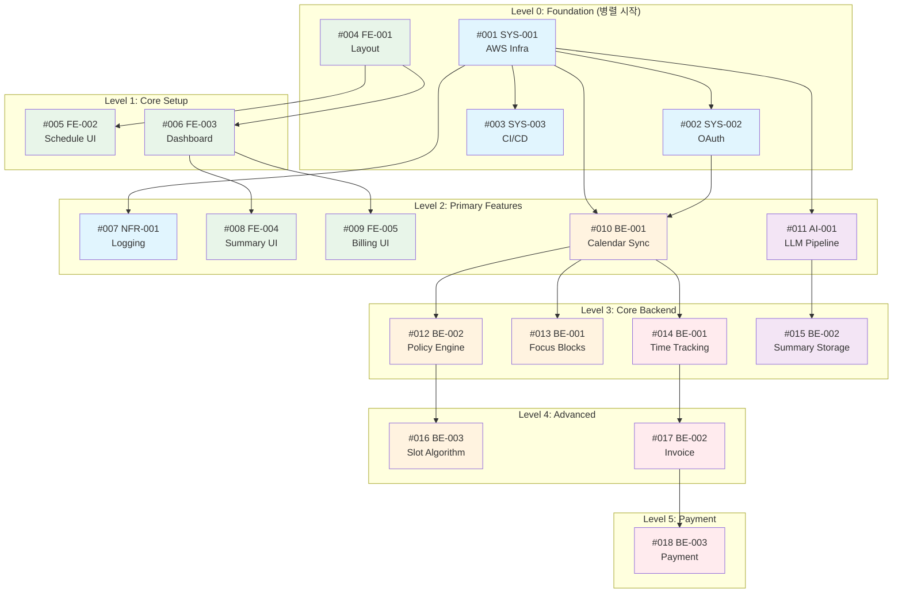

# GitHub Issue 실행 순서 및 의존성 가이드

## 📋 문서 개요

본 문서는 `docs/MVP_Task_WBS_and_DAG.md`에 정의된 **의존성 그래프(DAG)**를 기반으로 GitHub Issue의 **정확한 실행 순서**와 **병렬 개발 가능 작업**을 정의합니다.

> **📢 중요 공지**  
> EPIC-0 FE 이슈들(#004, #005, #006, #008, #009)은 **별도 프론트엔드 프로젝트에서 완료**되었습니다.  
> 해당 이슈들은 GitHub Issue 발행 대상에서 제외되며, 아래 문서에서 ~~취소선~~ 또는 ✅ 완료로 표시됩니다.

---

## 🗺️ 의존성 그래프 (DAG) 시각화



---

## 📊 레벨별 실행 순서

### 🟢 Level 0: Foundation (병렬 시작 가능)

> **Parallel Group**: `group-0-foundation`  
> **선행 작업**: 없음  
> **예상 소요**: 1-2주

| Issue # | Task ID | Title | Effort | 담당 | 비고 |
|---------|---------|-------|--------|------|------|
| **#001** | EPIC4-SYS-001 | AWS 인프라 및 DB 구축 | L | DevOps | 🚨 **Critical Path** |
| **#002** | EPIC4-SYS-002 | OAuth 2.0 인증 구현 | L | Backend | depends on #001 |
| **#003** | EPIC4-SYS-003 | CI/CD 파이프라인 구성 | M | DevOps | depends on #001 |
| ~~#004~~ | ~~EPIC0-FE-001~~ | ~~공통 레이아웃 및 내비게이션~~ | ~~S~~ | ~~Frontend~~ | ✅ **완료** (별도 프로젝트) |

**실행 전략**:
- #001 우선 착수 후 #002, #003 순차/병렬 진행
- ~~#001과 #004는 **완전 병렬** 실행 가능~~ → FE 완료됨

---

### 🔵 Level 1: Core Setup ✅ 완료

> **Parallel Group**: `group-1-core-setup`  
> **상태**: 별도 FE 프로젝트에서 완료됨

| Issue # | Task ID | Title | Effort | Dependencies | 담당 |
|---------|---------|-------|--------|--------------|------|
| ~~#005~~ | ~~EPIC0-FE-002~~ | ~~스케줄링 예약 페이지 UI~~ | ~~M~~ | ~~#004~~ | ✅ **완료** |
| ~~#006~~ | ~~EPIC0-FE-003~~ | ~~대시보드 및 캘린더 뷰~~ | ~~M~~ | ~~#004~~ | ✅ **완료** |

**실행 전략**:
- ~~#005와 #006은 **병렬 개발 가능**~~ → **완료됨**

---

### 🟣 Level 2: Primary Features

> **Parallel Groups**: `group-2-infra`, `group-2-backend`  
> **선행 작업**: Level 0  
> **예상 소요**: 2주

| Issue # | Task ID | Title | Effort | Dependencies | 담당 |
|---------|---------|-------|--------|--------------|------|
| **#007** | EPIC4-NFR-001 | 구조화 로깅 및 모니터링 | M | #001 | Backend/DevOps |
| ~~#008~~ | ~~EPIC0-FE-004~~ | ~~회의 요약 및 액션 아이템 뷰~~ | ~~S~~ | ~~#006~~ | ✅ **완료** |
| ~~#009~~ | ~~EPIC0-FE-005~~ | ~~시간 기록 및 인보이스 UI~~ | ~~M~~ | ~~#006~~ | ✅ **완료** |
| **#010** | EPIC1-BE-001 | Calendar 양방향 동기화 | XL | #001, #002 | Backend |
| **#011** | EPIC2-AI-001 | LLM 요약 파이프라인 | XL | #001 | AI/Backend |

**실행 전략**:
- **#007, #011**: #001 완료 즉시 착수 (BE/AI 팀 병렬)
- ~~**#008, #009**: FE 팀 병렬 개발~~ → **완료됨**
- **#010**: OAuth(#002) 완료 필수 → 🚨 **Critical Path**
- #010과 #011은 **독립 병렬 개발 가능**

---

### 🟠 Level 3: Core Backend Features

> **Parallel Groups**: `group-3-calendar`, `group-3-ai`, `group-3-billing`  
> **선행 작업**: Level 2 (Core Backend)  
> **예상 소요**: 2주

| Issue # | Task ID | Title | Effort | Dependencies | 담당 |
|---------|---------|-------|--------|--------------|------|
| **#012** | EPIC1-BE-002 | 정책 엔진 (타임존/업무시간) | L | #010 | Backend |
| **#013** | EPIC2-BE-001 | 포커스 블록 생성 및 차단 | L | #010 | Backend |
| **#014** | EPIC3-BE-001 | 자동 시간 기록 (TimeEntry) | XL | #010 | Backend |
| **#015** | EPIC2-BE-002 | LLM 요약 저장 및 Action Item | L | #011 | Backend |

**실행 전략**:
- **#012, #013, #014**: #010 완료 후 **3명이 병렬 개발**
- **#015**: #011 완료 후 착수 (AI 팀 연계)
- 🚨 **#012 → #016** 경로가 Critical Path

---

### 🔴 Level 4: Advanced Features

> **Parallel Groups**: `group-4-slot`, `group-4-invoice`  
> **선행 작업**: Level 3 (부분)  
> **예상 소요**: 1-2주

| Issue # | Task ID | Title | Effort | Dependencies | 담당 |
|---------|---------|-------|--------|--------------|------|
| **#016** | EPIC1-BE-003 | 가용 슬롯 계산 알고리즘 | XL | #012 | Backend |
| **#017** | EPIC3-BE-002 | 인보이스 자동 생성 | XL | #014 | Backend |

**실행 전략**:
- **#016**: Policy Engine(#012) 완료 필수 → 🚨 **Critical Path 종점**
- **#017**: Time Tracking(#014) 완료 필수
- #016과 #017은 **병렬 개발 가능**

---

### ⚫ Level 5: Payment

> **Parallel Group**: `group-5-payment`  
> **선행 작업**: Level 4 Invoice  
> **예상 소요**: 1주

| Issue # | Task ID | Title | Effort | Dependencies | 담당 |
|---------|---------|-------|--------|--------------|------|
| **#018** | EPIC3-BE-003 | Stripe 결제 연동 | L | #017 | Backend |

**실행 전략**:
- Invoice(#017) 완료 후 순차 진행
- 결제 연동은 마지막 단계로 안정성 확보

---

## 🚨 Critical Path (최장 경로)

MVP 완료까지의 **최장 의존성 경로**입니다. 이 경로의 지연은 전체 프로젝트 지연으로 이어집니다.

```
#001 (L) → #002 (L) → #010 (XL) → #012 (L) → #016 (XL)
  5일       5일        8일         5일        8일    = 31일
```

**권장사항**:
1. Critical Path 작업에 **가장 숙련된 개발자** 배치
2. 해당 작업들의 **블로커 즉시 해결** 우선순위 부여
3. 일일 스탠드업에서 Critical Path 진행 상황 필수 체크

---

## 🚀 팀 규모별 실행 전략

### Scenario A: 1인 팀 (BE/Infra 풀스택)

> FE가 완료되어 BE 중심 개발

| 주차 | 작업 내용 |
|------|-----------|
| Week 1-2 | #001 → #002, #003 |
| Week 3-4 | #010 (Calendar Sync), #007 |
| Week 5 | #011 (LLM), #012 |
| Week 6-7 | #016, #013, #014 |
| Week 8 | #015, #017 → #018 |

### Scenario B: 2인 팀 (BE 2)

> FE가 완료되어 BE 집중 개발

| 주차 | BE-1 | BE-2 |
|------|------|------|
| Week 1 | #001 → #002 | #003 |
| Week 2 | #010 시작 | #007, #011 시작 |
| Week 3 | #010 완료 | #011 완료 → #015 |
| Week 4 | #012 → #016 | #013, #014 |
| Week 5-6 | #016 완료 | #017 → #018 |

### Scenario C: 3인 팀 (BE 2 + DevOps/AI 1)

> FE가 완료되어 BE/인프라 집중

| 주차 | BE-1 | BE-2 | DevOps/AI |
|------|------|------|-----------|
| Week 1 | #002 | - | #001, #003 |
| Week 2 | #010 시작 | #013 준비 | #007, #011 |
| Week 3 | #010 완료, #012 | #013 | #011 완료, #015 |
| Week 4 | #016 | #014 | 모니터링 강화 |
| Week 5 | #016 완료 | #017 → #018 | 배포 자동화 |

---

## 📌 병렬 개발 체크리스트

### ✅ 병렬 진행 가능 (BE 중심)

| 조합 | 조건 | 상태 |
|------|------|------|
| ~~#001 ↔ #004~~ | ~~완전 독립 (Infra ↔ FE)~~ | FE 완료 |
| ~~#005 ↔ #006~~ | ~~동일 의존성 (#004)~~ | FE 완료 |
| ~~#008 ↔ #009~~ | ~~동일 의존성 (#006)~~ | FE 완료 |
| #007 ↔ #010 ↔ #011 | 모두 #001 의존 (서로 독립) | **유효** |
| #012 ↔ #013 ↔ #014 | 모두 #010 의존 (서로 독립) | **유효** |
| #016 ↔ #017 | 서로 다른 의존성 경로 | **유효** |

### ❌ 순차 진행 필수

| 경로 | 이유 |
|------|------|
| #001 → #002 | OAuth는 DB 인프라 필요 |
| #001 → #010 | Calendar Sync는 DB 필요 |
| #010 → #012 → #016 | Policy → Slot 알고리즘 체인 |
| #011 → #015 | LLM 결과 저장 |
| #014 → #017 → #018 | Billing 체인 |

---

## 🎯 마일스톤 정의

### Milestone 1: `MVP-Phase-0-Infrastructure`
- **포함**: #001, #002, #003 (~~#004 완료~~)
- **목표**: 개발 환경 및 인프라 완성
- **기간**: 2주
- **완료 조건**: 
  - Docker/Cloud 환경에서 앱 실행 가능
  - OAuth 로그인 동작
  - CI/CD 파이프라인 구동

### Milestone 2: `MVP-Phase-1-Core-Features`
- **포함**: #007, #010, #011 (~~#005-#009 FE 완료~~)
- **목표**: 핵심 백엔드 기능
- **기간**: 2주
- **완료 조건**:
  - ~~FE 전체 화면 Mock 연동~~ → 별도 프로젝트 완료
  - Calendar 동기화 동작
  - LLM 요약 파이프라인 구동

### Milestone 3: `MVP-Phase-2-Backend-Complete`
- **포함**: #012-#016
- **목표**: 백엔드 핵심 로직 완성
- **기간**: 2주
- **완료 조건**:
  - 슬롯 계산 API 동작
  - 포커스 블록 차단 동작
  - 요약 저장 및 조회 가능

### Milestone 4: `MVP-Phase-3-Billing-Complete`
- **포함**: #017, #018
- **목표**: 청구 시스템 완성
- **기간**: 2주
- **완료 조건**:
  - 인보이스 자동 생성
  - Stripe 결제 연동

---

## 📞 이슈 상태 관리

### GitHub Project Board 컬럼

| 컬럼 | 설명 |
|------|------|
| **📋 Backlog** | 아직 시작 조건 미충족 |
| **🔜 Ready** | 선행 작업 완료, 착수 가능 |
| **🚧 In Progress** | 현재 진행 중 |
| **👀 In Review** | PR 리뷰 대기 |
| **✅ Done** | 완료 |

### 추천 라벨

```
priority:must    - 필수 작업
priority:should  - 권장 작업
size:S|M|L|XL   - 작업 규모
epic:0|1|2|3|4  - Epic 그룹
domain:fe|be|ai|infra - 담당 도메인
parallel-group:N - 병렬 그룹 번호
critical-path   - Critical Path 작업
```

---

## ⚠️ 주의사항

1. **선행 작업 확인**: 이슈 시작 전 Dependencies의 모든 작업이 `Done` 상태인지 확인
2. **Critical Path 우선**: 표시된 Critical Path 작업은 최우선 처리
3. **병렬 작업 조율**: 동일 파일 수정 시 충돌 방지를 위해 사전 협의
4. **상태 즉시 업데이트**: 작업 시작/완료 시 Project Board 즉시 반영

---

---

## 📊 발행 현황 요약

| 구분 | 이슈 번호 | 개수 |
|------|-----------|------|
| 발행 대상 | #001, #002, #003, #007, #010-#018 | **13개** |
| 완료 (제외) | #004, #005, #006, #008, #009 | 5개 |

---

**문서 버전**: v2.1  
**최종 업데이트**: 2025-12-01  
**기반 문서**: `docs/MVP_Task_WBS_and_DAG.md`  
**변경 사항**: EPIC-0 FE 이슈 완료 반영


